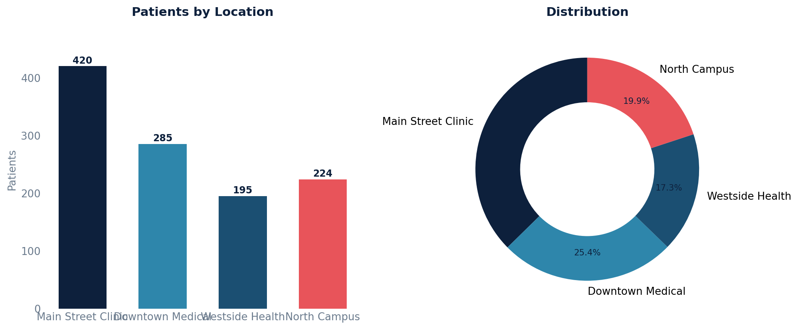

# Patients by Location

Patient distribution across practice locations, based on each patient's assigned default location.

## SQL

```sql
SELECT
    loc.id        AS location_id,
    loc.full_name AS location_name,
    COUNT(DISTINCT p.id) AS patient_count
FROM api_patient p
JOIN api_practicelocation loc ON loc.id = p.default_location_id
WHERE p.active = TRUE
  AND p.under_construction = FALSE
GROUP BY loc.id, loc.full_name
ORDER BY patient_count DESC;
```

## Columns Returned

| Column | Description |
|--------|-------------|
| `location_id` | Internal practice location ID |
| `location_name` | Full name of the practice location |
| `patient_count` | Number of active patients assigned to this location |

## Including Unassigned Patients

To also show patients with no assigned location:

```sql
SELECT
    COALESCE(loc.full_name, '(Unassigned)') AS location_name,
    COUNT(DISTINCT p.id) AS patient_count
FROM api_patient p
LEFT JOIN api_practicelocation loc ON loc.id = p.default_location_id
WHERE p.active = TRUE
  AND p.under_construction = FALSE
GROUP BY loc.id, loc.full_name
ORDER BY patient_count DESC;
```

## Sample Output

*Synthetic data for illustration purposes.*

| Location ID | Location Name       | Patients |
|-------------|---------------------|--------:|
|           1 | Main Street Clinic  |     420 |
|           4 | North Campus        |     224 |
|           2 | Downtown Medical    |     285 |
|           3 | Westside Health     |     195 |

### Visualization



## Notes

- Distribution is based on the `default_location_id` field on the patient record, not on appointment location history.
