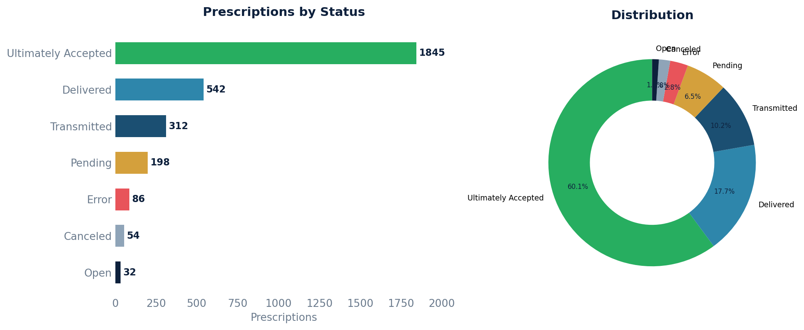

# Prescription Status Report

Counts prescriptions by their current e-prescribing status, with date ranges and patient/prescriber counts.

## SQL

```sql
SELECT
    p.status,
    COUNT(*)                                 AS total,
    COUNT(DISTINCT p.patient_id)             AS unique_patients,
    COUNT(DISTINCT p.prescriber_id)          AS unique_prescribers,
    MIN(p.written_date)                      AS earliest_written,
    MAX(p.written_date)                      AS latest_written
FROM api_prescription p
WHERE p.deleted = false
  AND p.committer_id IS NOT NULL
  AND p.entered_in_error_id IS NULL
GROUP BY p.status
ORDER BY total DESC;
```

## Columns Returned

| Column | Description |
|--------|-------------|
| `status` | Prescription status code (see reference below) |
| `total` | Number of prescriptions in this status |
| `unique_patients` | Number of distinct patients |
| `unique_prescribers` | Number of distinct prescribers |
| `earliest_written` | Oldest written date in this status |
| `latest_written` | Most recent written date in this status |

## Sample Output

*Synthetic data for illustration purposes.*

| Status               | Total | Patients | Prescribers | Earliest   | Latest     |
|----------------------|------:|---------:|------------:|------------|------------|
| ultimately-accepted  | 1,845 |      685 |           5 | 2023-01-04 | 2026-02-20 |
| delivered            |   542 |      312 |           5 | 2024-06-12 | 2026-02-19 |
| transmitted          |   312 |      198 |           4 | 2025-01-08 | 2026-02-18 |
| pending              |   198 |      142 |           4 | 2025-08-15 | 2026-02-20 |
| error                |    86 |       68 |           3 | 2024-03-22 | 2026-02-17 |
| canceled             |    54 |       42 |           3 | 2024-09-10 | 2026-02-15 |
| open                 |    32 |       28 |           2 | 2026-02-18 | 2026-02-20 |

### Visualization



## Status Reference

| Status | Meaning |
|--------|---------|
| `open` | Newly created, not yet transmitted |
| `pending` | Awaiting pharmacy response |
| `ultimately-accepted` | Accepted by pharmacy |
| `error` | Transmission or processing error |
| `cancel-requested` | Cancellation has been requested |
| `canceled` | Successfully cancelled |
| `cancel-denied` | Pharmacy denied the cancellation |
| `received` | Received by the e-prescribing network |
| `signed` | Signed by the prescriber |
| `inqueue` | Queued for transmission |
| `transmitted` | Sent to the pharmacy |
| `delivered` | Confirmed delivered to the pharmacy |
