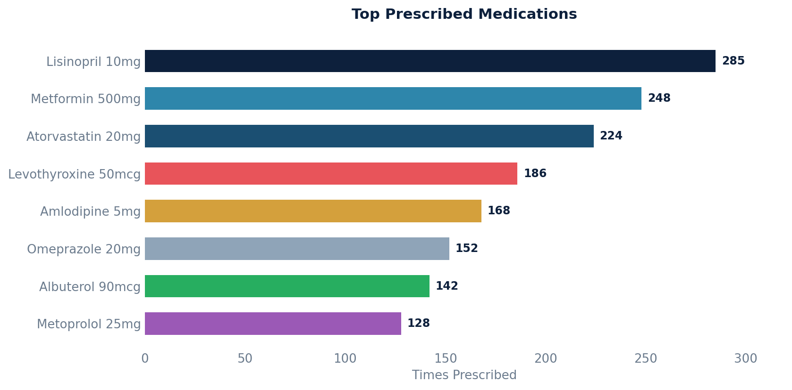

# Prescriptions by Drug

Ranks medications by how frequently they are prescribed, including NDC, unique patient and prescriber counts, and average quantity and duration.

## SQL

```sql
SELECT
    mc.display                               AS medication_name,
    mc.code                                  AS medication_code,
    mc.system                                AS coding_system,
    m.national_drug_code                     AS ndc,
    COUNT(*)                                 AS times_prescribed,
    COUNT(DISTINCT p.patient_id)             AS unique_patients,
    COUNT(DISTINCT p.prescriber_id)          AS unique_prescribers,
    ROUND(AVG(p.dispense_quantity)::numeric, 1)  AS avg_dispense_qty,
    ROUND(AVG(p.duration_in_days)::numeric, 1)   AS avg_duration_days
FROM api_prescription p
JOIN api_medication m ON p.medication_id = m.id
JOIN api_medicationcoding mc ON mc.medication_id = m.id
WHERE p.deleted = false
  AND p.committer_id IS NOT NULL
  AND p.entered_in_error_id IS NULL
GROUP BY mc.display, mc.code, mc.system, m.national_drug_code
ORDER BY times_prescribed DESC;
```

## Columns Returned

| Column | Description |
|--------|-------------|
| `medication_name` | Display name of the medication |
| `medication_code` | Drug code (RxNorm, FDB, etc.) |
| `coding_system` | Code system used |
| `ndc` | National Drug Code |
| `times_prescribed` | Total number of times this drug was prescribed |
| `unique_patients` | Number of distinct patients prescribed this drug |
| `unique_prescribers` | Number of distinct prescribers who prescribed it |
| `avg_dispense_qty` | Average dispense quantity |
| `avg_duration_days` | Average prescription duration in days |

## Sample Output

*Synthetic data for illustration purposes.*

| Medication            | NDC           | Prescribed | Patients | Prescribers | Avg Qty | Avg Days |
|-----------------------|---------------|----------:|---------:|------------:|--------:|---------:|
| Lisinopril 10mg Tab   | 68180-0513-01 |       285 |      198 |           4 |    30.0 |     30.0 |
| Metformin 500mg Tab   | 00093-7214-01 |       248 |      172 |           4 |    60.0 |     30.0 |
| Atorvastatin 20mg Tab | 00378-3952-77 |       224 |      168 |           5 |    30.0 |     30.0 |
| Levothyroxine 50mcg   | 00781-5072-01 |       186 |      142 |           3 |    30.0 |     30.0 |
| Amlodipine 5mg Tab    | 00093-3171-01 |       168 |      128 |           4 |    30.0 |     30.0 |
| Omeprazole 20mg Cap   | 00093-5288-01 |       152 |      112 |           4 |    30.0 |     30.0 |

### Visualization


