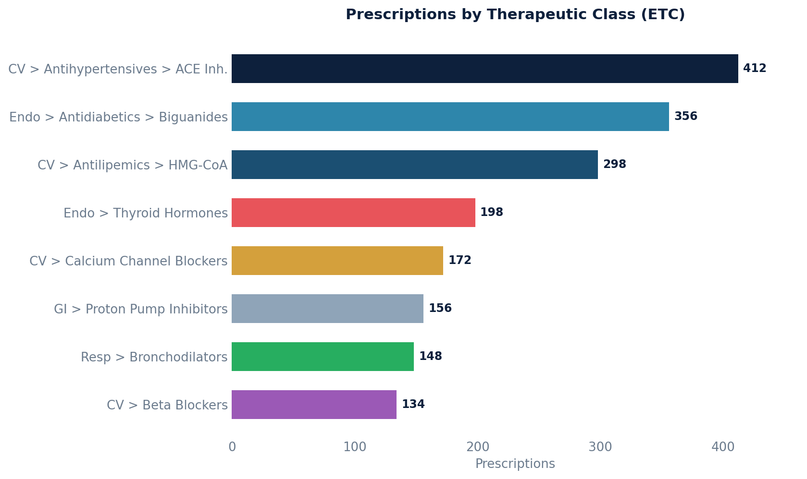

# Prescriptions by Drug Class (Therapeutic Class)

Groups prescriptions by their Enhanced Therapeutic Classification (ETC) path — a hierarchical drug class (e.g., "Cardiovascular > Antihypertensive > ACE Inhibitors").

## SQL

```sql
SELECT
    m.etc_path_name                          AS therapeutic_class_path,
    COUNT(*)                                 AS total_prescriptions,
    COUNT(DISTINCT mc.display)               AS unique_drugs_in_class,
    COUNT(DISTINCT p.patient_id)             AS unique_patients,
    COUNT(DISTINCT p.prescriber_id)          AS unique_prescribers
FROM api_prescription p
JOIN api_medication m ON p.medication_id = m.id
LEFT JOIN api_medicationcoding mc ON mc.medication_id = m.id
WHERE p.deleted = false
  AND p.committer_id IS NOT NULL
  AND p.entered_in_error_id IS NULL
  AND m.etc_path_name IS NOT NULL
GROUP BY m.etc_path_name
ORDER BY total_prescriptions DESC;
```

## Columns Returned

| Column | Description |
|--------|-------------|
| `therapeutic_class_path` | Full ETC hierarchy path (array) for the drug class |
| `total_prescriptions` | Total prescriptions in this class |
| `unique_drugs_in_class` | Number of distinct medications in this class |
| `unique_patients` | Number of distinct patients prescribed drugs in this class |
| `unique_prescribers` | Number of distinct prescribers |

## Sample Output

*Synthetic data for illustration purposes.*

| Therapeutic Class Path                          | Prescriptions | Drugs | Patients | Prescribers |
|-------------------------------------------------|-------------:|------:|---------:|------------:|
| Cardiovascular > Antihypertensives > ACE Inh.   |          412 |     6 |      285 |           5 |
| Endocrine > Antidiabetics > Biguanides          |          356 |     3 |      248 |           4 |
| Cardiovascular > Antilipemics > HMG-CoA Reductase|         298 |     5 |      224 |           5 |
| Endocrine > Thyroid Hormones                    |          198 |     4 |      186 |           3 |
| Cardiovascular > Calcium Channel Blockers       |          172 |     4 |      142 |           4 |
| Gastrointestinal > Proton Pump Inhibitors       |          156 |     3 |      128 |           4 |

### Visualization



## Notes

- The `etc_path_name` column is an array showing the full class hierarchy.
- Medications without an ETC classification are excluded (`IS NOT NULL` filter).
