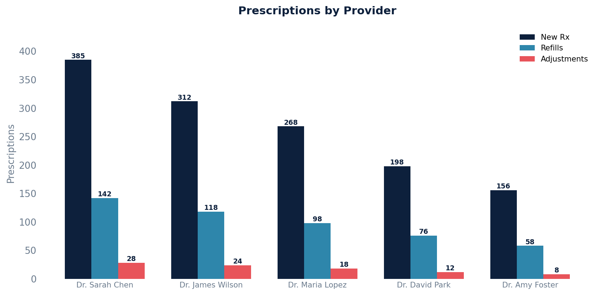

# Prescriptions by Provider

Shows each prescribing provider's total prescriptions, unique patients treated, refills, dosage adjustments, distinct medications prescribed, and EPCS (electronic prescriptions for controlled substances) count.

## SQL

```sql
SELECT
    s.id                                     AS provider_id,
    s.first_name || ' ' || s.last_name       AS provider_name,
    COUNT(*)                                  AS total_prescriptions,
    COUNT(DISTINCT p.patient_id)              AS unique_patients,
    SUM(CASE WHEN p.is_refill THEN 1 ELSE 0 END)      AS refills,
    SUM(CASE WHEN p.is_adjustment THEN 1 ELSE 0 END)   AS adjustments,
    COUNT(DISTINCT p.medication_id)           AS unique_medications,
    SUM(CASE WHEN p.is_epcs THEN 1 ELSE 0 END)         AS epcs_prescriptions
FROM api_prescription p
JOIN api_staff s ON p.prescriber_id = s.id
WHERE p.deleted = false
  AND p.committer_id IS NOT NULL
  AND p.entered_in_error_id IS NULL
GROUP BY s.id, s.first_name, s.last_name
ORDER BY total_prescriptions DESC;
```

## Columns Returned

| Column | Description |
|--------|-------------|
| `provider_id` | Internal staff ID for the prescriber |
| `provider_name` | Prescriber's full name |
| `total_prescriptions` | Total prescriptions written |
| `unique_patients` | Number of distinct patients prescribed to |
| `refills` | Count of refill prescriptions |
| `adjustments` | Count of dosage adjustment prescriptions |
| `unique_medications` | Number of distinct medications prescribed |
| `epcs_prescriptions` | Count of electronic prescriptions for controlled substances |

## Sample Output

*Synthetic data for illustration purposes.*

| Provider         | Total Rx | Patients | Refills | Adjustments | Unique Meds | EPCS |
|------------------|--------:|---------:|--------:|------------:|------------:|-----:|
| Dr. Sarah Chen   |     555 |      312 |     142 |          28 |          85 |   18 |
| Dr. James Wilson |     454 |      268 |     118 |          24 |          72 |   14 |
| Dr. Maria Lopez  |     384 |      224 |      98 |          18 |          68 |   10 |
| Dr. David Park   |     286 |      198 |      76 |          12 |          54 |    8 |
| Dr. Amy Foster   |     222 |      156 |      58 |           8 |          42 |    6 |

### Visualization


