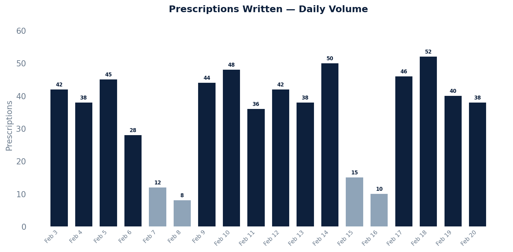

# Prescriptions Written Report

Counts all prescriptions by the date they were written, breaking out refills and dosage adjustments separately, along with unique patient and prescriber counts.

## SQL

```sql
SELECT
    DATE(p.written_date AT TIME ZONE 'UTC') AS written_date,
    COUNT(*)                                 AS total_prescriptions,
    COUNT(DISTINCT p.patient_id)             AS unique_patients,
    COUNT(DISTINCT p.prescriber_id)          AS unique_prescribers,
    SUM(CASE WHEN p.is_refill THEN 1 ELSE 0 END)     AS refills,
    SUM(CASE WHEN p.is_adjustment THEN 1 ELSE 0 END)  AS adjustments
FROM api_prescription p
WHERE p.deleted = false
  AND p.committer_id IS NOT NULL
  AND p.entered_in_error_id IS NULL
  AND p.written_date >= :start_date          -- replace with your date range
  AND p.written_date <  :end_date
GROUP BY DATE(p.written_date AT TIME ZONE 'UTC')
ORDER BY written_date;
```

## Columns Returned

| Column | Description |
|--------|-------------|
| `written_date` | Date the prescription was written (UTC) |
| `total_prescriptions` | Total prescriptions written that day |
| `unique_patients` | Number of distinct patients prescribed to |
| `unique_prescribers` | Number of distinct prescribers |
| `refills` | Count of refill prescriptions |
| `adjustments` | Count of dosage adjustment prescriptions |

## Sample Output

*Synthetic data for illustration purposes.*

| Written Date | Total Rx | Patients | Prescribers | Refills | Adjustments |
|--------------|--------:|---------:|------------:|--------:|------------:|
| 2026-02-20   |      38 |       32 |           4 |      12 |           3 |
| 2026-02-19   |      52 |       44 |           5 |      16 |           4 |
| 2026-02-18   |      46 |       38 |           4 |      14 |           2 |
| 2026-02-17   |      10 |        8 |           2 |       4 |           0 |
| 2026-02-16   |      15 |       12 |           2 |       5 |           1 |
| 2026-02-15   |      40 |       34 |           4 |      12 |           3 |

### Visualization



## Notes

- Replace `:start_date` / `:end_date` with your desired date range (e.g., `'2024-01-01'`).
- Only committed, non-deleted, non-entered-in-error prescriptions are included.
