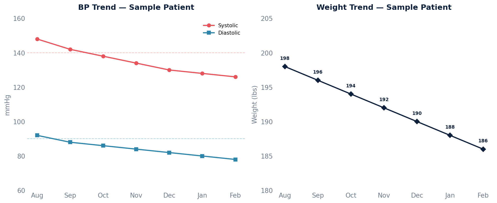

# Vital Signs by Patient

Trending of BP, weight, BMI, and other vital signs per patient. Returns all committed vital sign readings sorted by patient and most recent reading first so you can see trends over time.

## SQL

```sql
SELECT
    p.id                AS patient_id,
    p.key               AS patient_key,
    p.first_name,
    p.last_name,
    vs.sign             AS vital_type,
    vs.value,
    vs.units,
    vs.date_recorded
FROM api_vitalsign vs
JOIN api_vitalsignreading vsr ON vs.reading_id = vsr.id
JOIN api_patient p           ON vsr.patient_id = p.id
WHERE vsr.deleted = FALSE
  AND vsr.entered_in_error_id IS NULL
  AND vsr.committer_id IS NOT NULL
  AND vs.sign IN (
      'systole', 'diastole', 'weight', 'bmi',
      'height', 'body_temperature', 'pulse',
      'oxygen_saturation', 'respiration_rate'
  )
ORDER BY p.last_name, p.first_name, vs.sign, vs.date_recorded DESC;
```

## Columns Returned

| Column | Description |
|--------|-------------|
| `patient_id` | Internal patient ID |
| `patient_key` | Patient MRN / external key |
| `first_name` | Patient first name |
| `last_name` | Patient last name |
| `vital_type` | Vital sign type (systole, diastole, weight, bmi, height, body_temperature, pulse, oxygen_saturation, respiration_rate) |
| `value` | Recorded value (stored as text) |
| `units` | Unit of measure |
| `date_recorded` | Date/time the vital sign was recorded |

## Sample Output

*Synthetic data for illustration purposes.*

| Patient Key | Name          | Vital       | Value | Units  | Date       |
|-------------|---------------|-------------|------:|--------|------------|
| PT-10042    | Adams, Karen  | systole     |   126 | mmHg   | 2026-02-10 |
| PT-10042    | Adams, Karen  | systole     |   128 | mmHg   | 2026-01-15 |
| PT-10042    | Adams, Karen  | systole     |   134 | mmHg   | 2025-12-08 |
| PT-10042    | Adams, Karen  | diastole    |    78 | mmHg   | 2026-02-10 |
| PT-10042    | Adams, Karen  | weight      |  2976 | oz     | 2026-02-10 |
| PT-10042    | Adams, Karen  | bmi         |  26.4 |        | 2026-02-10 |
| PT-10038    | Chen, Robert  | systole     |   148 | mmHg   | 2026-02-08 |
| PT-10038    | Chen, Robert  | pulse       |    72 | bpm    | 2026-02-08 |

### Visualization



## Notes

- Only committed readings are included (`committer_id IS NOT NULL`, `entered_in_error_id IS NULL`, `deleted = FALSE`).
- **Weight** values are stored in ounces — divide by 16 for pounds, or by 35.274 for kilograms.
- **Height** values are stored in inches.
- The `value` column is stored as text. Cast to numeric before doing calculations.
