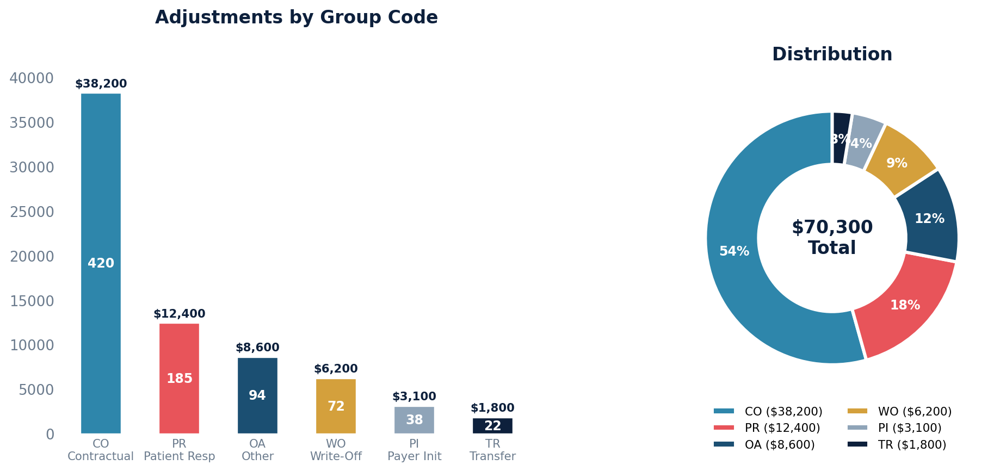

# Adjustment Report

Pulls all active (non-voided) line-item adjustments with their group code, reason code, and posting date.

## SQL

```sql
SELECT
    c.id                        AS claim_id,
    adj.amount                  AS adjustment_amount,
    adj."group"                 AS adjustment_type,
    adj.code                    AS adjustment_code,
    bp.created                  AS posted_date
FROM quality_and_revenue_newlineitemadjustment adj
JOIN quality_and_revenue_baseposting bp
    ON bp.id = adj.posting_id
JOIN quality_and_revenue_claim c
    ON c.id = bp.claim_id
WHERE adj.entered_in_error_id IS NULL
  AND bp.entered_in_error_id IS NULL
ORDER BY bp.created DESC;
```

## Columns Returned

| Column | Description |
|--------|-------------|
| `claim_id` | Internal claim identifier |
| `adjustment_amount` | Dollar amount of the adjustment |
| `adjustment_type` | Group code (e.g., CO, PR, OA — see reference below) |
| `adjustment_code` | Specific reason code for the adjustment |
| `posted_date` | Date/time the posting was created |

## Sample Output

*Synthetic data for illustration purposes.*

| Claim ID | Adjustment Amount | Type | Code | Posted Date        |
|---------:|------------------:|------|------|--------------------|
|     1042 |           $85.00  | CO   | 45   | 2026-02-20 14:32   |
|     1038 |           $42.50  | CO   | 45   | 2026-02-19 10:15   |
|     1038 |          $120.00  | PR   | 1    | 2026-02-19 10:15   |
|     1035 |           $65.00  | OA   | 23   | 2026-02-18 16:45   |
|     1031 |          $180.00  | WO   | 253  | 2026-02-18 11:20   |
|     1028 |           $35.00  | CO   | 97   | 2026-02-17 09:30   |

### Visualization



## Adjustment Group Codes Reference

| Code | Meaning |
|------|---------|
| CO | Contractual Obligation |
| PR | Patient Responsibility |
| OA | Other Adjustment |
| PI | Payer Initiated |
| WO | Write-Off |
| CW | Coinsurance/Withhold |
| CR | Correction/Reversal |
| TR | Transfer |

## Notes

- Only active adjustments are included — entered-in-error adjustments and postings are excluded.
- These queries have not been validated against a live database.
- To filter by date range, add `AND bp.created >= '2024-01-01'`.
