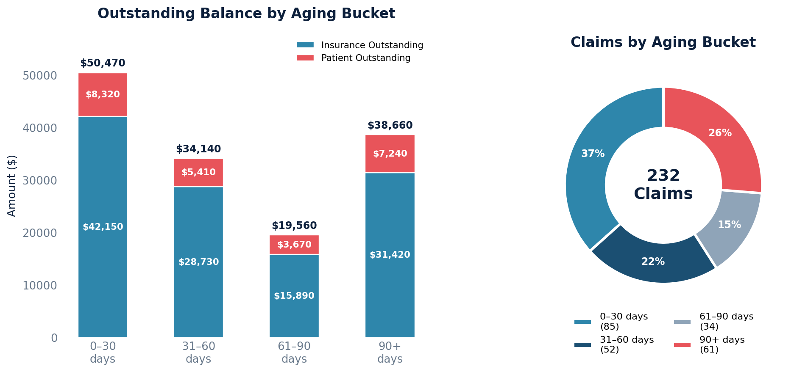

# A/R Aging Summary

Groups outstanding claim balances into standard aging buckets based on how many days have elapsed since the date of service.

Excludes claims in the Zero Balance (History) and Trash queues, focusing only on claims with outstanding balances.

## SQL

```sql
SELECT
    CASE
        WHEN (CURRENT_DATE - n.datetime_of_service::date) BETWEEN 0 AND 30 THEN '0-30 days'
        WHEN (CURRENT_DATE - n.datetime_of_service::date) BETWEEN 31 AND 60 THEN '31-60 days'
        WHEN (CURRENT_DATE - n.datetime_of_service::date) BETWEEN 61 AND 90 THEN '61-90 days'
        WHEN (CURRENT_DATE - n.datetime_of_service::date) > 90 THEN '90+ days'
        ELSE 'Unknown'
    END AS aging_bucket,
    COUNT(*) AS claim_count,
    SUM(c.patient_balance + c.aggregate_coverage_balance) AS total_outstanding,
    SUM(c.aggregate_coverage_balance) AS insurance_outstanding,
    SUM(c.patient_balance) AS patient_outstanding
FROM quality_and_revenue_claim c
JOIN quality_and_revenue_queue q ON q.id = c.current_queue_id
LEFT JOIN api_note n ON n.id = c.note_id
WHERE q.queue_sort_ordering NOT IN (9, 10)   /* exclude Zero Balance and Trash */
  AND (c.patient_balance + c.aggregate_coverage_balance) > 0
GROUP BY
    CASE
        WHEN (CURRENT_DATE - n.datetime_of_service::date) BETWEEN 0 AND 30 THEN '0-30 days'
        WHEN (CURRENT_DATE - n.datetime_of_service::date) BETWEEN 31 AND 60 THEN '31-60 days'
        WHEN (CURRENT_DATE - n.datetime_of_service::date) BETWEEN 61 AND 90 THEN '61-90 days'
        WHEN (CURRENT_DATE - n.datetime_of_service::date) > 90 THEN '90+ days'
        ELSE 'Unknown'
    END
ORDER BY MIN(CURRENT_DATE - n.datetime_of_service::date);
```

## Columns Returned

| Column | Description |
|--------|-------------|
| `aging_bucket` | 0–30, 31–60, 61–90, or 90+ days since date of service |
| `claim_count` | Number of open claims in that bucket |
| `total_outstanding` | Combined insurance + patient balance |
| `insurance_outstanding` | Portion still owed by insurance |
| `patient_outstanding` | Portion that is patient responsibility |

## Sample Output

*Synthetic data for illustration purposes.*

| Aging Bucket | Claim Count | Total Outstanding | Insurance Outstanding | Patient Outstanding |
|-------------|------------:|------------------:|----------------------:|--------------------:|
| 0–30 days   |          85 |          $50,470  |              $42,150  |             $8,320  |
| 31–60 days  |          52 |          $34,140  |              $28,730  |             $5,410  |
| 61–90 days  |          34 |          $19,560  |              $15,890  |             $3,670  |
| 90+ days    |          61 |          $38,660  |              $31,420  |             $7,240  |
| **TOTAL**   |     **232** |     **$142,830**  |         **$118,190**  |        **$24,640**  |

### Visualization



## Key Concepts

- Aging is calculated from the **date of service** on the associated note, not the claim creation date — this aligns with standard A/R aging methodology.
- `patient_balance` on a claim is the computed amount the patient owes after all payments, adjustments, and transfers have been applied.
- `aggregate_coverage_balance` is the computed amount insurance still owes on the claim.
