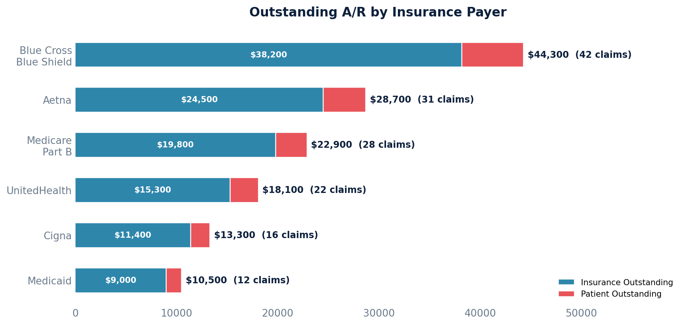

# A/R by Insurance Payer

Summarizes outstanding receivables by the insurance company currently responsible for each claim.

Excludes claims in the Zero Balance (History) and Trash queues, focusing only on claims with outstanding balances.

## SQL

```sql
SELECT
    cc.payer_name,
    cc.payer_id AS payer_identifier,
    COUNT(DISTINCT c.id) AS open_claim_count,
    SUM(c.aggregate_coverage_balance) AS insurance_outstanding,
    SUM(c.patient_balance) AS patient_outstanding,
    SUM(c.patient_balance + c.aggregate_coverage_balance) AS total_outstanding
FROM quality_and_revenue_claim c
JOIN quality_and_revenue_queue q ON q.id = c.current_queue_id
JOIN quality_and_revenue_claimcoverage cc ON cc.id = c.current_coverage_id
WHERE q.queue_sort_ordering NOT IN (9, 10)
  AND (c.patient_balance + c.aggregate_coverage_balance) > 0
  AND cc.active = TRUE
GROUP BY cc.payer_name, cc.payer_id
ORDER BY total_outstanding DESC;
```

## Columns Returned

| Column | Description |
|--------|-------------|
| `payer_name` | Insurance company name |
| `payer_identifier` | Payer ID code |
| `open_claim_count` | Number of open claims filed to this payer |
| `insurance_outstanding` | Amount owed by this payer |
| `patient_outstanding` | Patient responsibility on these claims |
| `total_outstanding` | Combined outstanding amount |

## Sample Output

*Synthetic data for illustration purposes.*

| Payer Name                | Payer ID  | Open Claims | Insurance Outstanding | Patient Outstanding | Total Outstanding |
|---------------------------|-----------|------------:|----------------------:|--------------------:|------------------:|
| Blue Cross Blue Shield    | BCBS001   |          42 |              $38,200  |             $6,100  |          $44,300  |
| Aetna                     | AETNA01   |          31 |              $24,500  |             $4,200  |          $28,700  |
| Medicare Part B           | MCR002    |          28 |              $19,800  |             $3,100  |          $22,900  |
| UnitedHealth              | UHC001    |          22 |              $15,300  |             $2,800  |          $18,100  |
| Cigna                     | CIGNA01   |          16 |              $11,400  |             $1,900  |          $13,300  |
| Medicaid                  | MCD001    |          12 |               $9,000  |             $1,500  |          $10,500  |

### Visualization



## Notes

- This query uses the claim's **current coverage assignment**. Claims without an assigned coverage (e.g., patient-only claims) will not appear.
- Remove the `cc.active = TRUE` filter if you want to include inactive coverages.

## Key Concepts

- `patient_balance` on a claim is the computed amount the patient owes after all payments, adjustments, and transfers have been applied.
- `aggregate_coverage_balance` is the computed amount insurance still owes on the claim.
