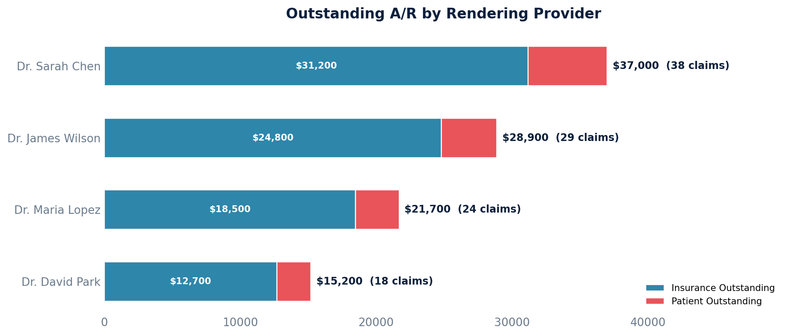

# A/R by Provider

Groups outstanding receivables by the rendering provider on each claim.

Excludes claims in the Zero Balance (History) and Trash queues, focusing only on claims with outstanding balances.

## SQL

```sql
SELECT
    cp.provider_first_name || ' ' || cp.provider_last_name AS rendering_provider,
    cp.provider_npi,
    COUNT(DISTINCT c.id) AS open_claim_count,
    SUM(c.patient_balance + c.aggregate_coverage_balance) AS total_outstanding,
    SUM(c.aggregate_coverage_balance) AS insurance_outstanding,
    SUM(c.patient_balance) AS patient_outstanding
FROM quality_and_revenue_claim c
JOIN quality_and_revenue_queue q ON q.id = c.current_queue_id
JOIN quality_and_revenue_claimprovider cp ON cp.claim_id = c.id
WHERE q.queue_sort_ordering NOT IN (9, 10)
  AND (c.patient_balance + c.aggregate_coverage_balance) > 0
GROUP BY cp.provider_first_name, cp.provider_last_name, cp.provider_npi
ORDER BY total_outstanding DESC;
```

## Columns Returned

| Column | Description |
|--------|-------------|
| `rendering_provider` | Provider's full name |
| `provider_npi` | Provider's NPI number |
| `open_claim_count` | Number of open claims for this provider |
| `total_outstanding` | Combined outstanding balance |
| `insurance_outstanding` | Amount owed by insurance |
| `patient_outstanding` | Amount owed by patients |

## Sample Output

*Synthetic data for illustration purposes.*

| Rendering Provider | NPI         | Open Claims | Total Outstanding | Insurance Outstanding | Patient Outstanding |
|--------------------|-------------|------------:|------------------:|----------------------:|--------------------:|
| Dr. Sarah Chen     | 1234567890  |          38 |          $37,000  |              $31,200  |             $5,800  |
| Dr. James Wilson   | 1234567891  |          29 |          $28,900  |              $24,800  |             $4,100  |
| Dr. Maria Lopez    | 1234567892  |          24 |          $21,700  |              $18,500  |             $3,200  |
| Dr. David Park     | 1234567893  |          18 |          $15,200  |              $12,700  |             $2,500  |

### Visualization



## Key Concepts

- `patient_balance` on a claim is the computed amount the patient owes after all payments, adjustments, and transfers have been applied.
- `aggregate_coverage_balance` is the computed amount insurance still owes on the claim.
