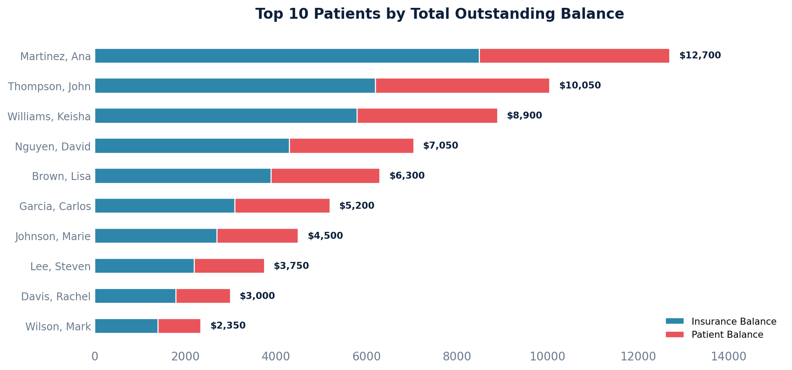

# A/R Detail by Patient

Shows each patient's total outstanding balance across all open claims, along with the date of their most recent payment.

Excludes claims in the Zero Balance (History) and Trash queues, focusing only on claims with outstanding balances.

## SQL

```sql
SELECT
    p.id AS patient_id,
    p.first_name || ' ' || p.last_name AS patient_name,
    p.mrn,
    SUM(c.patient_balance + c.aggregate_coverage_balance) AS total_outstanding,
    SUM(c.patient_balance) AS patient_balance,
    SUM(c.aggregate_coverage_balance) AS insurance_balance,
    COUNT(c.id) AS open_claim_count,
    MAX(lip.created) AS last_payment_date
FROM quality_and_revenue_claim c
JOIN quality_and_revenue_queue q ON q.id = c.current_queue_id
JOIN api_note n ON n.id = c.note_id
JOIN api_patient p ON p.id = n.patient_id
LEFT JOIN quality_and_revenue_baseposting bp
    ON bp.claim_id = c.id
   AND bp.entered_in_error_id IS NULL
   AND bp.deleted = FALSE
LEFT JOIN quality_and_revenue_newlineitempayment lip
    ON lip.posting_id = bp.id
   AND lip.entered_in_error_id IS NULL
WHERE q.queue_sort_ordering NOT IN (9, 10)
  AND (c.patient_balance + c.aggregate_coverage_balance) > 0
GROUP BY p.id, p.first_name, p.last_name, p.mrn
ORDER BY total_outstanding DESC;
```

## Columns Returned

| Column | Description |
|--------|-------------|
| `patient_id` | Internal patient identifier |
| `patient_name` | Patient's full name |
| `mrn` | Medical record number |
| `total_outstanding` | Combined outstanding balance |
| `patient_balance` | Amount the patient owes |
| `insurance_balance` | Amount insurance owes |
| `open_claim_count` | Number of open claims for this patient |
| `last_payment_date` | Date/time of the most recent payment posted to any of this patient's open claims |

## Sample Output

*Synthetic data for illustration purposes (top 10 by total outstanding).*

| Patient Name       | MRN     | Total Outstanding | Patient Balance | Insurance Balance | Open Claims | Last Payment   |
|--------------------|---------|------------------:|----------------:|------------------:|------------:|----------------|
| Martinez, Ana      | MRN-001 |          $12,700  |         $4,200  |           $8,500  |           4 | 2026-02-10     |
| Thompson, John     | MRN-002 |          $10,050  |         $3,850  |           $6,200  |           3 | 2026-01-28     |
| Williams, Keisha   | MRN-003 |           $8,900  |         $3,100  |           $5,800  |           3 | 2026-02-05     |
| Nguyen, David      | MRN-004 |           $7,050  |         $2,750  |           $4,300  |           2 | 2026-01-15     |
| Brown, Lisa        | MRN-005 |           $6,300  |         $2,400  |           $3,900  |           2 | 2026-02-12     |
| Garcia, Carlos     | MRN-006 |           $5,200  |         $2,100  |           $3,100  |           2 | 2025-12-20     |
| Johnson, Marie     | MRN-007 |           $4,500  |         $1,800  |           $2,700  |           2 | 2026-01-08     |
| Lee, Steven        | MRN-008 |           $3,750  |         $1,550  |           $2,200  |           1 | 2026-02-01     |
| Davis, Rachel      | MRN-009 |           $3,000  |         $1,200  |           $1,800  |           1 | 2025-11-30     |
| Wilson, Mark       | MRN-010 |           $2,350  |           $950  |           $1,400  |           1 | 2026-01-22     |

### Visualization



## Key Concepts

- `patient_balance` on a claim is the computed amount the patient owes after all payments, adjustments, and transfers have been applied.
- `aggregate_coverage_balance` is the computed amount insurance still owes on the claim.
- Only valid (non-entered-in-error, non-deleted) postings and payments are considered when determining the last payment date.
