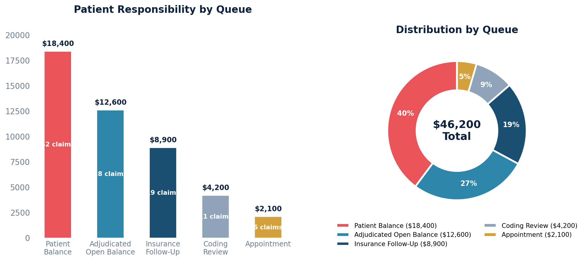

# Patient Balance Report (by Queue)

Lists every patient who has a positive patient-responsibility balance, broken down by the claim queue they're currently in.

Excludes claims in the Zero Balance (History) and Trash queues.

## SQL

```sql
SELECT
    p.id AS patient_id,
    p.first_name || ' ' || p.last_name AS patient_name,
    p.mrn,
    SUM(c.patient_balance) AS patient_responsibility,
    COUNT(c.id) AS claim_count,
    q.name AS current_queue
FROM quality_and_revenue_claim c
JOIN quality_and_revenue_queue q ON q.id = c.current_queue_id
JOIN api_note n ON n.id = c.note_id
JOIN api_patient p ON p.id = n.patient_id
WHERE q.queue_sort_ordering NOT IN (9, 10)
  AND c.patient_balance > 0
GROUP BY p.id, p.first_name, p.last_name, p.mrn, q.name
ORDER BY patient_responsibility DESC;
```

## Columns Returned

| Column | Description |
|--------|-------------|
| `patient_id` | Internal patient identifier |
| `patient_name` | Patient's full name |
| `mrn` | Medical record number |
| `patient_responsibility` | Total amount the patient owes |
| `claim_count` | Number of claims with a patient balance |
| `current_queue` | Which claim workflow queue those claims are in (e.g., "Patient Balance", "Adjudicated Open Balance") |

## Sample Output

*Synthetic data for illustration purposes.*

| Patient Name       | MRN     | Patient Responsibility | Claim Count | Current Queue            |
|--------------------|---------|-----------------------:|------------:|--------------------------|
| Martinez, Ana      | MRN-001 |               $2,850   |           3 | Patient Balance          |
| Thompson, John     | MRN-002 |               $2,100   |           2 | Patient Balance          |
| Williams, Keisha   | MRN-003 |               $1,750   |           2 | Adjudicated Open Balance |
| Nguyen, David      | MRN-004 |               $1,400   |           1 | Patient Balance          |
| Brown, Lisa        | MRN-005 |               $1,200   |           1 | Adjudicated Open Balance |
| Garcia, Carlos     | MRN-006 |                 $980   |           1 | Insurance Follow-Up      |
| Johnson, Marie     | MRN-007 |                 $750   |           1 | Coding Review            |
| Lee, Steven        | MRN-008 |                 $620   |           1 | Appointment              |

### Summary by Queue

| Queue                    | Total Balance | Claim Count |
|--------------------------|:------------:|:-----------:|
| Patient Balance          |      $18,400 |          42 |
| Adjudicated Open Balance |      $12,600 |          28 |
| Insurance Follow-Up      |       $8,900 |          19 |
| Coding Review            |       $4,200 |          11 |
| Appointment              |       $2,100 |           6 |

### Visualization



## Tips

- If you want a **single row per patient** (without the queue breakdown), remove `q.name` from both the `SELECT` and `GROUP BY` clauses.

## Key Concepts

- `patient_balance` on a claim is the computed amount the patient owes after all payments, adjustments, and transfers have been applied.
- Claims are excluded when they are in the Zero Balance queue (fully resolved) or the Trash queue (voided/deleted).
