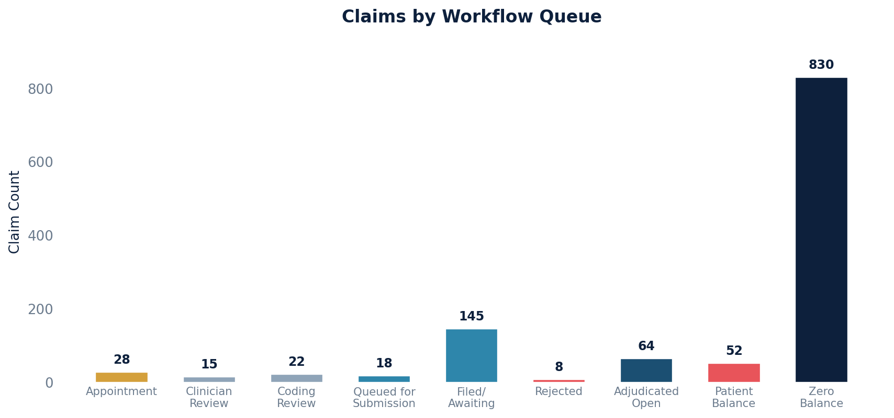

# Claim Details

Retrieves claim information, including claim ID, associated procedure codes (CPT), diagnosis codes (ICD-10), place of service, and the current workflow queue.

## SQL

```sql
SELECT
    c.id AS claim_id,
    c.externally_exposable_id AS claim_uuid,
    cli.place_of_service AS cpt_pos,
    cli.proc_code AS cpt,
    cdx.code AS icd10_code,
    cdx.display AS condition,
    q.description AS current_queue
FROM
    quality_and_revenue_claim c
LEFT JOIN public.quality_and_revenue_claimlineitem cli ON c.id = cli.claim_id
LEFT JOIN quality_and_revenue_claimdiagnosiscode cdx ON c.id = cdx.claim_id
LEFT JOIN public.quality_and_revenue_queue q ON c.current_queue_id = q.id;
```

## Columns Returned

| Column | Description |
|--------|-------------|
| `claim_id` | Internal claim identifier |
| `claim_uuid` | External UUID for the claim |
| `cpt_pos` | Place of service code on the line item |
| `cpt` | Procedure (CPT) code |
| `icd10_code` | Diagnosis (ICD-10) code |
| `condition` | Display name of the diagnosis |
| `current_queue` | Description of the current claim workflow queue |

## Sample Output

*Synthetic data for illustration purposes.*

| Claim ID | CPT POS | CPT   | ICD-10 Code | Condition                     | Current Queue          |
|---------:|--------:|-------|-------------|-------------------------------|------------------------|
|     1042 |      11 | 99213 | J06.9       | Acute upper respiratory infxn  | Filed / Awaiting       |
|     1042 |      11 | 99213 | R05.9       | Cough, unspecified            | Filed / Awaiting       |
|     1038 |      11 | 99214 | E11.9       | Type 2 diabetes, unspecified  | Adjudicated Open       |
|     1035 |      02 | 99213 | I10         | Essential hypertension        | Patient Balance        |
|     1031 |      11 | 99215 | M54.5       | Low back pain                 | Zero Balance           |
|     1028 |      11 | 99203 | Z00.00      | General adult medical exam    | Queued for Submission  |

### Visualization



## Notes

- This query returns all claims with no filters applied. You may want to add WHERE clauses to filter by queue, date range, or other criteria.
- Claims with multiple line items or diagnosis codes will appear as multiple rows.
