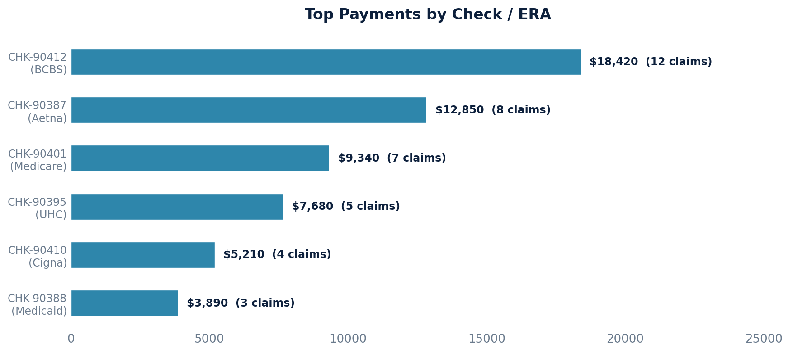

# Claim Payments

Aggregates payment amounts per claim and references the check number for ERAs (Electronic Remittance Advice) with multiple patients.

## SQL

```sql
SELECT
    ap.first_name || ' ' || ap.last_name AS patient_name,
    ap.key AS patient_key,
    cl.account_number AS claimaccount,
    cl.externally_exposable_id AS claim_external_id,
    pc.check_number AS check_number,
    pc.check_date AS check_date,
    SUM(nlp.amount) AS total_amount
FROM
    quality_and_revenue_newlineitempayment nlp
LEFT JOIN public.quality_and_revenue_baseposting bp ON nlp.posting_id = bp.id
LEFT JOIN quality_and_revenue_paymentcollection pc ON bp.payment_collection_id = pc.id
LEFT JOIN quality_and_revenue_claim cl ON bp.claim_id = cl.id
LEFT JOIN public.api_note an ON cl.note_id = an.id
LEFT JOIN public.api_patient ap ON an.patient_id = ap.id
GROUP BY
    ap.first_name, ap.last_name, ap.key,
    cl.account_number, pc.check_number, pc.check_date,
    cl.externally_exposable_id;
```

## Columns Returned

| Column | Description |
|--------|-------------|
| `patient_name` | Patient's full name |
| `patient_key` | Unique patient identifier |
| `claimaccount` | Claim account number |
| `claim_external_id` | External UUID for the claim |
| `check_number` | Check number from the payment collection (ERA) |
| `check_date` | Date of the check |
| `total_amount` | Sum of all line item payments for this claim/check combination |

## Sample Output

*Synthetic data for illustration purposes.*

| Patient Name     | Patient Key | Claim Account | Check Number | Check Date | Total Amount |
|------------------|-------------|---------------|--------------|------------|-------------:|
| Martinez, Ana    | PAT-001     | CLM-10042     | CHK-90412    | 2026-02-15 |     $1,850   |
| Martinez, Ana    | PAT-001     | CLM-10038     | CHK-90412    | 2026-02-15 |     $1,240   |
| Thompson, John   | PAT-002     | CLM-10035     | CHK-90387    | 2026-02-08 |     $2,180   |
| Williams, Keisha | PAT-003     | CLM-10031     | CHK-90401    | 2026-02-12 |     $1,680   |
| Nguyen, David    | PAT-004     | CLM-10028     | CHK-90395    | 2026-02-10 |     $1,100   |
| Brown, Lisa      | PAT-005     | CLM-10025     | CHK-90410    | 2026-02-14 |       $980   |

### Visualization



## Notes

- Payments are grouped by patient, claim, and check — so a single claim may have multiple rows if it received payments from different checks.
