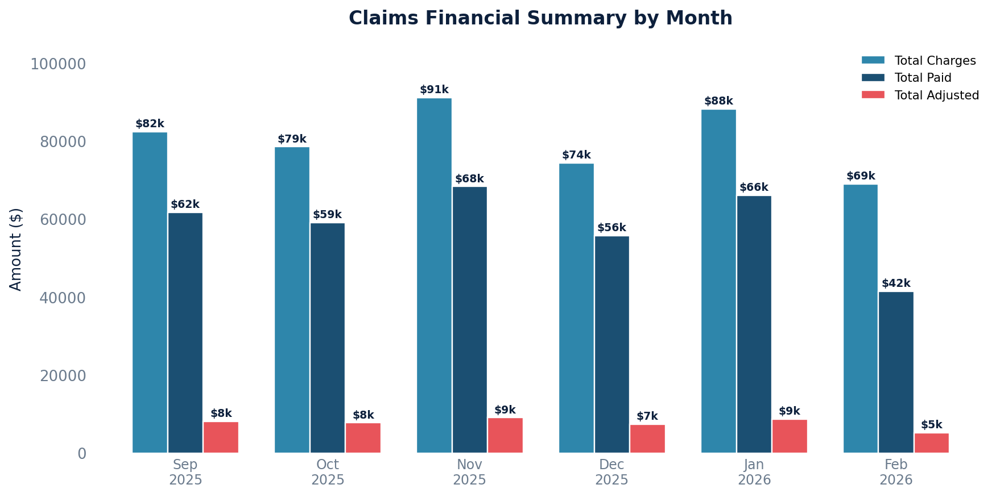

# Claims Export

Comprehensive claim-level detail suitable for export to spreadsheets or external systems. Includes patient, provider, location, payer, balances, and financial totals per claim.

## SQL

```sql
SELECT
    c.id                                                 AS claim_id,
    c.account_number,
    n.datetime_of_service                                AS date_of_service,
    p.first_name || ' ' || p.last_name                   AS patient_name,
    p.mrn                                                AS patient_mrn,
    s.first_name || ' ' || s.last_name                   AS provider_name,
    pl.full_name                                         AS location,
    q.display_name                                       AS current_queue,
    cc.payer_name                                        AS current_payer,
    cc.payer_order,
    c.patient_balance,
    c.aggregate_coverage_balance                         AS insurance_balance,
    c.patient_balance + c.aggregate_coverage_balance     AS total_balance,
    COALESCE(charges.total_charge, 0)                    AS total_charges,
    COALESCE(payments.total_paid, 0)                     AS total_paid,
    COALESCE(adjustments.total_adjusted, 0)              AS total_adjusted
FROM quality_and_revenue_claim c
JOIN quality_and_revenue_queue q ON q.id = c.current_queue_id
LEFT JOIN api_note n ON n.id = c.note_id
LEFT JOIN api_patient p ON p.id = n.patient_id
LEFT JOIN api_staff s ON s.id = n.provider_id
LEFT JOIN api_practicelocation pl ON pl.id = n.location_id
LEFT JOIN quality_and_revenue_claimcoverage cc ON cc.id = c.current_coverage_id
LEFT JOIN (
    SELECT cli.claim_id, SUM(cli.charge) AS total_charge
    FROM quality_and_revenue_claimlineitem cli
    WHERE cli.status = 'active' AND cli.proc_code NOT IN ('COPAY','UNLINKED')
    GROUP BY cli.claim_id
) charges ON charges.claim_id = c.id
LEFT JOIN (
    SELECT bp.claim_id, SUM(nlp.amount) AS total_paid
    FROM quality_and_revenue_baseposting bp
    JOIN quality_and_revenue_newlineitempayment nlp ON nlp.posting_id = bp.id
    WHERE bp.entered_in_error_id IS NULL AND nlp.entered_in_error_id IS NULL
    GROUP BY bp.claim_id
) payments ON payments.claim_id = c.id
LEFT JOIN (
    SELECT bp.claim_id, SUM(nla.amount) AS total_adjusted
    FROM quality_and_revenue_baseposting bp
    JOIN quality_and_revenue_newlineitemadjustment nla ON nla.posting_id = bp.id
    WHERE bp.entered_in_error_id IS NULL
      AND nla.entered_in_error_id IS NULL
      AND nla.write_off = TRUE
    GROUP BY bp.claim_id
) adjustments ON adjustments.claim_id = c.id
WHERE q.queue_sort_ordering != 10
ORDER BY n.datetime_of_service DESC;
```

## Columns Returned

| Column | Description |
|--------|-------------|
| `claim_id` | Internal claim identifier |
| `account_number` | Claim account number |
| `date_of_service` | Date of service from the associated note |
| `patient_name` | Patient's full name |
| `patient_mrn` | Medical record number |
| `provider_name` | Rendering provider's full name |
| `location` | Practice location name |
| `current_queue` | Current workflow queue/status |
| `current_payer` | Name of the currently assigned payer |
| `payer_order` | Payer order (primary, secondary, etc.) |
| `patient_balance` | Current patient balance on the claim |
| `insurance_balance` | Current insurance balance on the claim |
| `total_balance` | Combined patient + insurance balance |
| `total_charges` | Sum of active line item charges |
| `total_paid` | Sum of all valid payments posted |
| `total_adjusted` | Sum of all valid write-off adjustments |

## Sample Output

*Synthetic data for illustration purposes.*

| Claim ID | DOS        | Patient Name     | Provider         | Queue              | Payer | Total Charges | Total Paid | Total Adjusted | Total Balance |
|---------:|------------|------------------|------------------|--------------------|-------|:-------------:|-----------:|---------------:|--------------:|
|     1042 | 2026-02-10 | Martinez, Ana    | Dr. Sarah Chen   | Filed / Awaiting   | BCBS  |       $2,100  |    $1,850  |           $0   |         $250  |
|     1038 | 2026-02-05 | Thompson, John   | Dr. James Wilson | Adjudicated Open   | Aetna |       $1,800  |    $1,420  |         $180   |         $200  |
|     1035 | 2026-01-28 | Williams, Keisha | Dr. Maria Lopez  | Patient Balance    | UHC   |       $2,400  |    $1,680  |         $320   |         $400  |
|     1031 | 2026-01-22 | Nguyen, David    | Dr. Sarah Chen   | Zero Balance       | MCR   |       $1,500  |    $1,100  |         $400   |           $0  |
|     1028 | 2026-01-15 | Brown, Lisa      | Dr. David Park   | Queued for Submit  | Cigna |       $1,250  |       $0   |           $0   |       $1,250  |

### Visualization



## Notes

- Trashed claims (queue order 10) are excluded.
- Internal system line items (`COPAY`, `UNLINKED`) are excluded from charge totals.
- Entered-in-error postings, payments, and adjustments are excluded.
- Results are sorted by date of service, most recent first.
- To filter by date range, add `AND n.datetime_of_service BETWEEN '2024-01-01' AND '2024-12-31'`.
