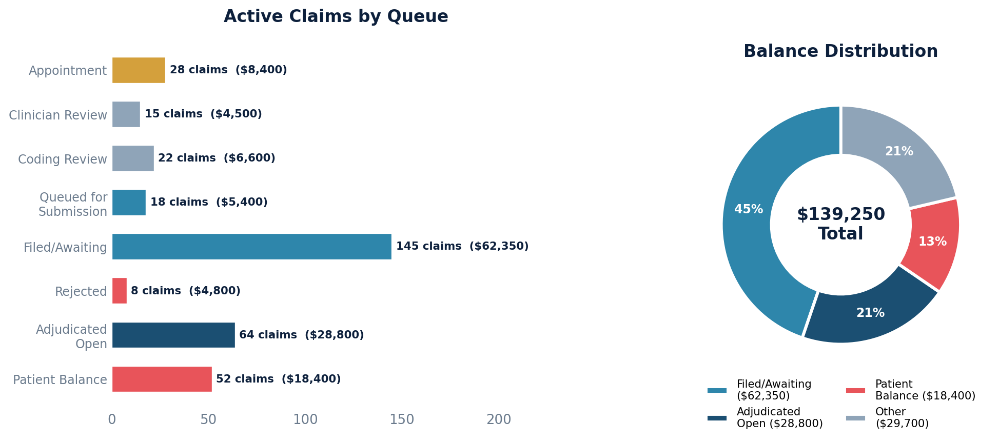

# Claims Status Report

Claims grouped by their current queue/status, with balance breakdowns. Gives a snapshot of where all claims sit in the billing workflow.

## SQL

```sql
SELECT
    q.display_name                                       AS queue_status,
    q.queue_sort_ordering                                AS queue_order,
    COUNT(c.id)                                          AS claim_count,
    SUM(c.patient_balance)                               AS total_patient_balance,
    SUM(c.aggregate_coverage_balance)                    AS total_insurance_balance,
    SUM(c.patient_balance + c.aggregate_coverage_balance) AS total_balance
FROM quality_and_revenue_queue q
LEFT JOIN quality_and_revenue_claim c ON c.current_queue_id = q.id
WHERE q.queue_sort_ordering != 10   -- exclude trashed
GROUP BY q.id, q.display_name, q.queue_sort_ordering
ORDER BY q.queue_sort_ordering;
```

## Columns Returned

| Column | Description |
|--------|-------------|
| `queue_status` | Display name of the claim workflow queue |
| `queue_order` | Sort order of the queue in the workflow |
| `claim_count` | Number of claims currently in this queue |
| `total_patient_balance` | Sum of patient balances for claims in this queue |
| `total_insurance_balance` | Sum of insurance balances for claims in this queue |
| `total_balance` | Combined patient + insurance balance |

## Queue Reference

| Queue Order | Status |
|-------------|--------|
| 1 | Appointment |
| 2 | Needs Clinician Review |
| 3 | Needs Coding Review |
| 4 | Queued for Submission |
| 5 | Filed / Awaiting Response |
| 6 | Rejected / Needs Review |
| 7 | Adjudicated / Open Balance |
| 8 | Patient Balance |
| 9 | Zero Balance |

## Sample Output

*Synthetic data for illustration purposes.*

| Queue Status           | Queue Order | Claim Count | Patient Balance | Insurance Balance | Total Balance |
|------------------------|:-----------:|------------:|----------------:|------------------:|--------------:|
| Appointment            |           1 |          28 |         $2,800  |           $5,600  |       $8,400  |
| Needs Clinician Review |           2 |          15 |         $1,500  |           $3,000  |       $4,500  |
| Needs Coding Review    |           3 |          22 |         $2,200  |           $4,400  |       $6,600  |
| Queued for Submission  |           4 |          18 |         $1,800  |           $3,600  |       $5,400  |
| Filed / Awaiting       |           5 |         145 |        $12,350  |          $50,000  |      $62,350  |
| Rejected / Needs Review|           6 |           8 |         $1,200  |           $3,600  |       $4,800  |
| Adjudicated Open       |           7 |          64 |         $9,600  |          $19,200  |      $28,800  |
| Patient Balance        |           8 |          52 |        $18,400  |              $0   |      $18,400  |
| Zero Balance           |           9 |         830 |            $0   |              $0   |          $0   |
| **TOTAL**              |             |    **1,182**|    **$49,850**  |      **$89,400**  | **$139,250**  |

### Visualization



## Notes

- Trashed claims (queue order 10) are excluded.
- The LEFT JOIN ensures all queues appear even if they have zero claims.
