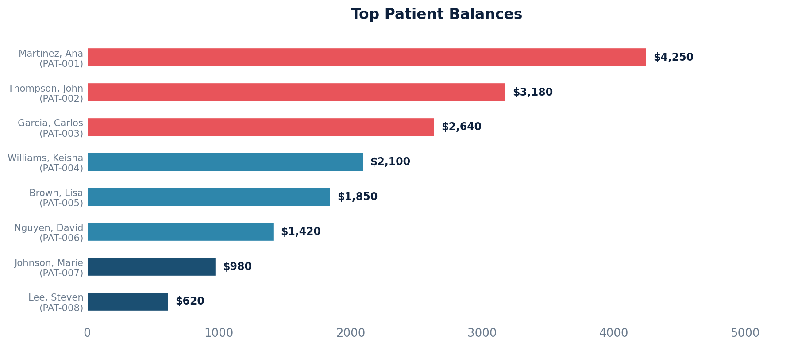

# Patient Balance

Aggregates current patient balances for all claims associated with each patient.

Uses a CTE to exclude claims with negative balances that have been fully processed (no coverage postings remaining), and excludes claims in the Trash or ZeroBalance queues.

## SQL

```sql
WITH claims AS (
    SELECT
        c.id AS claim_id,
        c.externally_exposable_id AS claim_uuid,
        c.patient_balance,
        p.key AS patient_key
    FROM
        quality_and_revenue_claim c
    JOIN api_note n ON n.id = c.note_id
    JOIN api_patient p ON p.id = n.patient_id
    INNER JOIN quality_and_revenue_queue q ON c.current_queue_id = q.id
    WHERE
        NOT (
            c.id IN (
                SELECT
                    V0.id
                FROM
                    quality_and_revenue_claim V0
                LEFT JOIN quality_and_revenue_baseposting V1 ON V0.id = V1.claim_id
                LEFT JOIN quality_and_revenue_coverageposting V2 ON V1.id = V2.baseposting_ptr_id
                WHERE
                    V0.patient_balance < 0
                    AND NOT EXISTS (
                        SELECT 1
                        FROM quality_and_revenue_claim U0
                        LEFT JOIN api_coverage U1 ON U0.id = V1.claim_id
                        WHERE U1.id IS NULL AND U0.id = V0.id
                        LIMIT 1
                    )
                GROUP BY
                    V0.id
                HAVING
                    COUNT(V1.id) FILTER (
                        WHERE V2.baseposting_ptr_id IS NOT NULL
                        AND V1.entered_in_error_id IS NULL
                    ) = 0
            )
        )
        AND q.name NOT IN ('Trash', 'ZeroBalance')
)
SELECT
    patient_key,
    SUM(patient_balance) AS total_patient_balance
FROM
    claims
GROUP BY
    patient_key;
```

## Columns Returned

| Column | Description |
|--------|-------------|
| `patient_key` | Unique patient identifier |
| `total_patient_balance` | Sum of patient balances across all qualifying claims |

## Sample Output

*Synthetic data for illustration purposes.*

| Patient Key | Total Patient Balance |
|-------------|----------------------:|
| PAT-001     |              $4,250   |
| PAT-002     |              $3,180   |
| PAT-003     |              $2,640   |
| PAT-004     |              $2,100   |
| PAT-005     |              $1,850   |
| PAT-006     |              $1,420   |
| PAT-007     |                $980   |
| PAT-008     |                $620   |

### Visualization



## Notes

- Claims in the Trash and ZeroBalance queues are excluded.
- Claims with negative patient balances that have no remaining coverage postings are also excluded (these represent fully processed overpayment scenarios).
