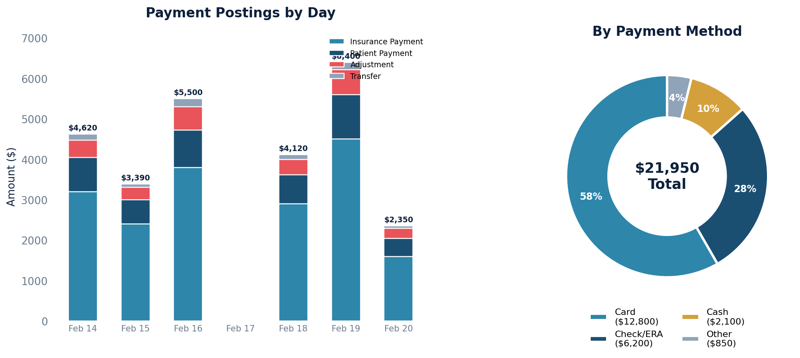

# Payment Posting Report

Every payment posting with details on who paid, how they paid, and what was applied to each claim. Includes payments, write-off adjustments, and transfers.

## SQL

```sql
SELECT
    bp.id                                                AS posting_id,
    bp.created                                           AS posting_date,
    c.account_number                                     AS claim_number,
    pat.first_name || ' ' || pat.last_name               AS patient_name,
    CASE
        WHEN cp.baseposting_ptr_id IS NOT NULL THEN 'Insurance'
        WHEN pp.baseposting_ptr_id IS NOT NULL THEN 'Patient'
    END                                                  AS posting_type,
    CASE
        WHEN cp.baseposting_ptr_id IS NOT NULL THEN cc.payer_name
        WHEN pp.baseposting_ptr_id IS NOT NULL THEN pat.first_name || ' ' || pat.last_name
    END                                                  AS payer,
    pc.method                                            AS payment_method,
    pc.check_number,
    pc.check_date,
    COALESCE(pay_totals.total_paid, 0)                   AS amount_paid,
    COALESCE(adj_totals.total_adjusted, 0)               AS amount_adjusted,
    COALESCE(xfer_totals.total_transferred, 0)           AS amount_transferred,
    bp.description                                       AS posting_description
FROM quality_and_revenue_baseposting bp
JOIN quality_and_revenue_claim c ON c.id = bp.claim_id
LEFT JOIN api_note n ON n.id = c.note_id
LEFT JOIN api_patient pat ON pat.id = n.patient_id
LEFT JOIN quality_and_revenue_paymentcollection pc ON pc.id = bp.payment_collection_id
LEFT JOIN quality_and_revenue_coverageposting cp ON cp.baseposting_ptr_id = bp.id
LEFT JOIN quality_and_revenue_claimcoverage cc ON cc.id = cp.claim_coverage_id
LEFT JOIN quality_and_revenue_patientposting pp ON pp.baseposting_ptr_id = bp.id
LEFT JOIN (
    SELECT posting_id, SUM(amount) AS total_paid
    FROM quality_and_revenue_newlineitempayment
    WHERE entered_in_error_id IS NULL
    GROUP BY posting_id
) pay_totals ON pay_totals.posting_id = bp.id
LEFT JOIN (
    SELECT posting_id, SUM(amount) AS total_adjusted
    FROM quality_and_revenue_newlineitemadjustment
    WHERE entered_in_error_id IS NULL AND write_off = TRUE
    GROUP BY posting_id
) adj_totals ON adj_totals.posting_id = bp.id
LEFT JOIN (
    SELECT posting_id, SUM(amount) AS total_transferred
    FROM quality_and_revenue_lineitemtransfer
    WHERE entered_in_error_id IS NULL
    GROUP BY posting_id
) xfer_totals ON xfer_totals.posting_id = bp.id
WHERE bp.entered_in_error_id IS NULL
ORDER BY bp.created DESC;
```

## Columns Returned

| Column | Description |
|--------|-------------|
| `posting_id` | Internal posting identifier |
| `posting_date` | Date/time the posting was created |
| `claim_number` | Claim account number |
| `patient_name` | Patient's full name |
| `posting_type` | "Insurance" or "Patient" |
| `payer` | Payer name (insurance company) or patient name |
| `payment_method` | How the payment was made (cash, check, card, other) |
| `check_number` | Check number, if applicable |
| `check_date` | Check date, if applicable |
| `amount_paid` | Total payment amount applied |
| `amount_adjusted` | Total write-off adjustment amount |
| `amount_transferred` | Total amount transferred (e.g., between coverages) |
| `posting_description` | Free-text description on the posting |

## Sample Output

*Synthetic data for illustration purposes.*

| Posting Date | Claim # | Patient Name   | Type      | Payer  | Method | Amount Paid | Adjusted | Transferred |
|--------------|---------|----------------|-----------|--------|--------|------------:|---------:|------------:|
| 2026-02-20   | CLM-1042 | Martinez, Ana | Insurance | BCBS   | check  |     $1,850  |    $250  |         $0  |
| 2026-02-20   | CLM-1042 | Martinez, Ana | Patient   |        | card   |       $150  |      $0  |         $0  |
| 2026-02-19   | CLM-1038 | Thompson, John| Insurance | Aetna  | check  |     $1,420  |    $180  |       $200  |
| 2026-02-19   | CLM-1035 | Williams, K.  | Insurance | UHC    | check  |     $1,680  |    $320  |         $0  |
| 2026-02-18   | CLM-1031 | Nguyen, David | Insurance | MCR    | check  |     $1,100  |    $400  |         $0  |
| 2026-02-18   | CLM-1031 | Nguyen, David | Patient   |        | cash   |       $150  |      $0  |         $0  |
| 2026-02-17   | CLM-1028 | Brown, Lisa   | Patient   |        | card   |       $200  |      $0  |         $0  |

### Visualization



## Notes

- Only valid postings are included (entered-in-error postings are excluded).
- Posting type is determined by which subtype exists — `coverageposting` (Insurance) or `patientposting` (Patient).
- Results are sorted by most recent posting first.
- To filter by date range, add `AND bp.created BETWEEN '2024-01-01' AND '2024-12-31'`.
