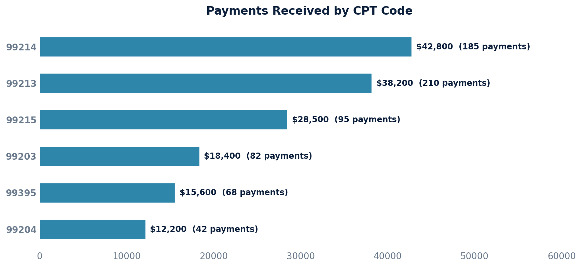

# Payment Report

Pulls all active line-item payments with the associated claim, billing code, and posting date.

## SQL

```sql
SELECT
    c.id                        AS claim_id,
    pmt.amount                  AS paid_amount,
    bp.created                  AS posted_date,
    cli.proc_code               AS billing_code
FROM quality_and_revenue_newlineitempayment pmt
JOIN quality_and_revenue_baseposting bp
    ON bp.id = pmt.posting_id
JOIN quality_and_revenue_claim c
    ON c.id = bp.claim_id
JOIN quality_and_revenue_claimlineitem cli
    ON cli.id = pmt.billing_line_item_id
WHERE pmt.entered_in_error_id IS NULL
  AND bp.entered_in_error_id IS NULL
ORDER BY bp.created DESC;
```

## Columns Returned

| Column | Description |
|--------|-------------|
| `claim_id` | Internal claim identifier |
| `paid_amount` | Payment amount applied to the line item |
| `posted_date` | Date/time the posting was created (not the check date) |
| `billing_code` | CPT/procedure code from the claim line item |

## Sample Output

*Synthetic data for illustration purposes.*

| Claim ID | Paid Amount | Posted Date        | Billing Code |
|---------:|------------:|--------------------|--------------|
|     1042 |     $195.00 | 2026-02-20 14:32   | 99214        |
|     1042 |      $85.00 | 2026-02-20 14:32   | 99213        |
|     1038 |     $275.00 | 2026-02-19 10:15   | 99215        |
|     1035 |     $130.00 | 2026-02-18 16:45   | 99213        |
|     1031 |     $185.00 | 2026-02-18 11:20   | 99203        |
|     1028 |     $220.00 | 2026-02-17 09:30   | 99395        |

### Visualization



## Notes

- Only active payments are included — entered-in-error payments and postings are excluded.
- These queries have not been validated against a live database.
- To filter by date range, add `AND bp.created >= '2024-01-01'`.
