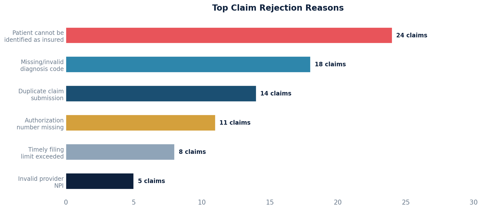

# Rejection Report

Pulls all rejected claim responses and their detailed payer messages. Shows the exact denial/rejection text from the payer (e.g., "ERA DENIAL - Claim denied as patient cannot be identified as our insured.").

## SQL

```sql
SELECT
    c.id                        AS claim_id,
    cr.response_time            AS posted_date,
    r.response                  AS payer_response_message
FROM quality_and_revenue_claimresponse cr
JOIN quality_and_revenue_claim c
    ON c.id = cr.claim_id
LEFT JOIN quality_and_revenue_response r
    ON r.claim_response_id = cr.id
WHERE cr.status = 'R'
ORDER BY c.id, cr.response_time DESC;
```

## Columns Returned

| Column | Description |
|--------|-------------|
| `claim_id` | Internal claim identifier |
| `posted_date` | Timestamp when the rejection response was received |
| `payer_response_message` | The exact rejection/denial message from the payer |

## Sample Output

*Synthetic data for illustration purposes.*

| Claim ID | Posted Date        | Payer Response Message                                                          |
|---------:|--------------------|---------------------------------------------------------------------------------|
|     1042 | 2026-02-20 08:15   | ERA DENIAL - Claim denied as patient cannot be identified as our insured.       |
|     1038 | 2026-02-19 14:30   | ERA DENIAL - Missing or invalid diagnosis code.                                 |
|     1038 | 2026-02-19 14:30   | ERA DENIAL - Procedure code inconsistent with modifier.                         |
|     1035 | 2026-02-18 09:45   | ERA DENIAL - Duplicate claim/service.                                           |
|     1031 | 2026-02-17 11:20   | ERA DENIAL - Prior authorization number missing or invalid.                     |
|     1028 | 2026-02-15 16:00   | ERA DENIAL - Timely filing limit has been exceeded.                             |

### Visualization



## Notes

- A single claim rejection can have **multiple response messages** (one row per denial reason), so you may see multiple rows per claim.
- The `status = 'R'` filter corresponds to `ClaimResponseStatus.REJECTED`.
- The payer response messages come from the `quality_and_revenue_response` table's `response` field, which stores the actual text returned by the payer.
- These queries have not been validated against a live database.
- To filter by date range, add `AND cr.response_time >= '2024-01-01'`.
