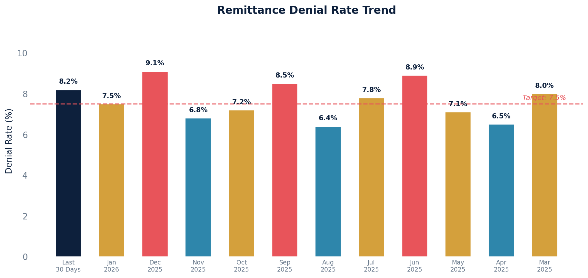

# Remittance Denial Rate

Calculates the remittance denial rate for distinct claims based on specific adjustment codes over a rolling 12-month period.

Shows both a "Last 30 Days" snapshot and monthly breakdowns, comparing the count of denied claims to total claims that received a remittance.

## SQL

```sql
-- Step 1: Identify all claims that have had a remittance posted within the last 12 months.
WITH submitted AS (
    SELECT DISTINCT
        cl.id AS claim_id,
        'Last 30 Days' AS remit_month,
        0 AS month_order,
        NULL::date AS date_month
    FROM quality_and_revenue_claim cl
    JOIN quality_and_revenue_baseposting bp ON cl.id = bp.claim_id
    JOIN quality_and_revenue_coverageposting cp ON cp.baseposting_ptr_id = bp.id
    WHERE
        bp.created >= (date_trunc('day', now()) - interval '30 days')
        AND bp.created <= now()
        AND bp.entered_in_error_id IS NULL
        AND cp.remittance_id IS NOT NULL

    UNION ALL

    SELECT DISTINCT
        cl.id AS claim_id,
        to_char(bp.created, 'Mon') AS remit_month,
        1 AS month_order,
        date_trunc('month', bp.created) AS date_month
    FROM quality_and_revenue_claim cl
    JOIN quality_and_revenue_baseposting bp ON cl.id = bp.claim_id
    JOIN quality_and_revenue_coverageposting cp ON cp.baseposting_ptr_id = bp.id
    WHERE
        date_trunc('day', bp.created) >= (date_trunc('day', now()) - interval '1 year')
        AND bp.created < date_trunc('month', now())
        AND bp.entered_in_error_id IS NOT NULL
),

-- Step 2: Identify distinct claims with denial adjustment codes of interest.
denials AS (
    SELECT DISTINCT
        sb.claim_id AS id,
        sb.remit_month
    FROM submitted sb
    JOIN quality_and_revenue_claimlineitem cli ON cli.claim_id = sb.claim_id
    JOIN quality_and_revenue_newlineitemadjustment adj ON adj.billing_line_item_id = cli.id
    WHERE
        adj.group NOT IN ('PR', 'CW')
        AND adj.code IN (
            '4','5','6','7','8','9','10','11','12','13','14','15','16','17','18','19','20','21','22','26','27','28','29','30','31','32','33',
            /* (More codes — see .sql file for full list) */
            'D6','D7','D8','P1','P10','P11','P12','P13','P14','P15','P16','P17','P2','P7','P8','P9'
        )
),

-- Step 3: Count the total claims with denials for each month.
count_denials AS (
    SELECT
        COUNT(id) AS count_denials,
        remit_month
    FROM denials
    GROUP BY remit_month
),

-- Step 4: Count the total number of claims received for each month.
count_claims AS (
    SELECT
        COUNT(sb.claim_id) AS count_claims,
        sb.remit_month,
        sb.month_order,
        sb.date_month
    FROM submitted sb
    GROUP BY remit_month, month_order, date_month
)

-- Final: Compute the denial rate.
SELECT
    cc.count_claims,
    cd.count_denials,
    CASE
        WHEN cd.count_denials IS NULL THEN 0
        ELSE ROUND(((cd.count_denials::numeric / cc.count_claims::numeric) * 100), 2)
    END AS PercentDenied,
    cc.remit_month,
    cc.date_month
FROM
    count_claims cc
LEFT JOIN count_denials cd ON cd.remit_month = cc.remit_month
ORDER BY
    cc.month_order ASC,
    cc.date_month DESC;
```

## Columns Returned

| Column | Description |
|--------|-------------|
| `count_claims` | Total number of claims that received a remittance in that period |
| `count_denials` | Number of those claims that had denial adjustment codes |
| `PercentDenied` | Denial rate as a percentage (denials / claims * 100) |
| `remit_month` | "Last 30 Days" or the month abbreviation (e.g., "Jan") |
| `date_month` | First day of the month (NULL for the "Last 30 Days" row) |

## Sample Output

*Synthetic data for illustration purposes.*

| Claims | Denials | % Denied | Period       | Month      |
|-------:|--------:|---------:|--------------|------------|
|    145 |      12 |    8.28% | Last 30 Days |            |
|    168 |      13 |    7.74% | Jan          | 2026-01-01 |
|    152 |      14 |    9.21% | Dec          | 2025-12-01 |
|    174 |      12 |    6.90% | Nov          | 2025-11-01 |
|    162 |      12 |    7.41% | Oct          | 2025-10-01 |
|    158 |      13 |    8.23% | Sep          | 2025-09-01 |
|    171 |      11 |    6.43% | Aug          | 2025-08-01 |
|    165 |      13 |    7.88% | Jul          | 2025-07-01 |
|    148 |      13 |    8.78% | Jun          | 2025-06-01 |
|    170 |      12 |    7.06% | May          | 2025-05-01 |
|    163 |      11 |    6.75% | Apr          | 2025-04-01 |
|    155 |      12 |    7.74% | Mar          | 2025-03-01 |

### Visualization



## Notes

- The "Last 30 Days" row provides a rolling recent snapshot and always appears first.
- Denial codes exclude PR (patient responsibility) and CW (coinsurance/withhold) adjustment groups.
- See the `.sql` file for the full list of denial adjustment codes used in the filter.
- The query uses a 4-step CTE approach: identify submitted claims, flag denials, count each, then calculate the rate.
