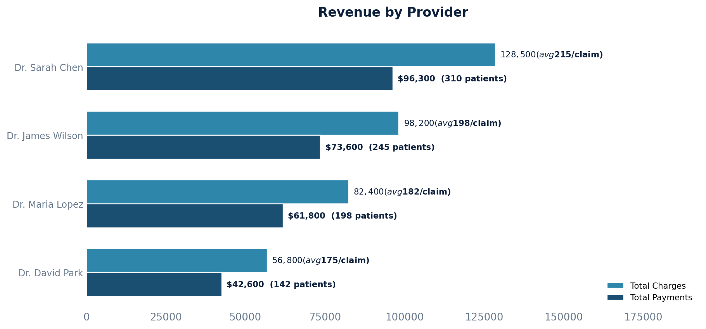

# Revenue by Provider

Provider productivity and revenue generation — charges, payments, patient volume, and average charge per claim.

## SQL

```sql
SELECT
    s.id                                                 AS provider_id,
    s.first_name || ' ' || s.last_name                   AS provider_name,
    COUNT(DISTINCT c.id)                                 AS claim_count,
    COUNT(DISTINCT n.patient_id)                         AS unique_patients,
    SUM(cli.charge)                                      AS total_charges,
    SUM(COALESCE(pay.paid, 0))                           AS total_payments,
    SUM(cli.charge)
      - SUM(COALESCE(pay.paid, 0))
      - SUM(COALESCE(adj.adjusted, 0))                   AS outstanding_balance,
    CASE WHEN COUNT(DISTINCT c.id) > 0
         THEN ROUND(SUM(cli.charge) / COUNT(DISTINCT c.id), 2)
         ELSE 0 END                                      AS avg_charge_per_claim
FROM api_staff s
JOIN api_note n ON n.provider_id = s.id
JOIN quality_and_revenue_claim c ON c.note_id = n.id
JOIN quality_and_revenue_queue q ON q.id = c.current_queue_id
JOIN quality_and_revenue_claimlineitem cli ON cli.claim_id = c.id
  AND cli.status = 'active'
  AND cli.proc_code NOT IN ('COPAY', 'UNLINKED')
LEFT JOIN (
    SELECT nlp.billing_line_item_id, SUM(nlp.amount) AS paid
    FROM quality_and_revenue_newlineitempayment nlp
    WHERE nlp.entered_in_error_id IS NULL
    GROUP BY nlp.billing_line_item_id
) pay ON pay.billing_line_item_id = cli.id
LEFT JOIN (
    SELECT nla.billing_line_item_id, SUM(nla.amount) AS adjusted
    FROM quality_and_revenue_newlineitemadjustment nla
    WHERE nla.entered_in_error_id IS NULL AND nla.write_off = TRUE
    GROUP BY nla.billing_line_item_id
) adj ON adj.billing_line_item_id = cli.id
WHERE q.queue_sort_ordering != 10
GROUP BY s.id, s.first_name, s.last_name
ORDER BY total_charges DESC;
```

## Columns Returned

| Column | Description |
|--------|-------------|
| `provider_id` | Internal staff ID for the provider |
| `provider_name` | Provider's full name |
| `claim_count` | Number of distinct claims for this provider |
| `unique_patients` | Number of unique patients seen |
| `total_charges` | Total amount charged |
| `total_payments` | Total payments received |
| `outstanding_balance` | Charges minus payments minus adjustments |
| `avg_charge_per_claim` | Average charge amount per claim |

## Sample Output

*Synthetic data for illustration purposes.*

| Provider         | Claims | Patients | Total Charges | Total Payments | Outstanding | Avg/Claim |
|------------------|-------:|---------:|--------------:|---------------:|------------:|----------:|
| Dr. Sarah Chen   |    598 |      310 |     $128,500  |       $96,300  |    $19,200  |   $214.88 |
| Dr. James Wilson |    496 |      245 |      $98,200  |       $73,600  |    $14,700  |   $197.98 |
| Dr. Maria Lopez  |    453 |      198 |      $82,400  |       $61,800  |    $12,300  |   $181.90 |
| Dr. David Park   |    325 |      142 |      $56,800  |       $42,600  |     $8,500  |   $174.77 |

### Visualization



## Notes

- Internal system line items (`COPAY`, `UNLINKED`) are excluded from charge calculations.
- Only active line items on non-trashed claims are included.
- To filter by date range, add `AND n.datetime_of_service BETWEEN '2024-01-01' AND '2024-12-31'`.
