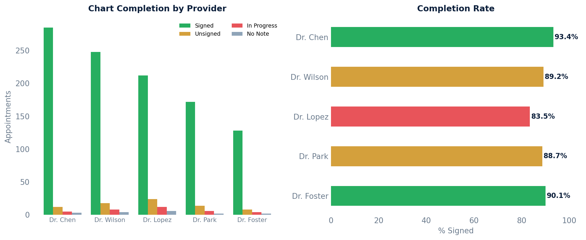

# Appointment vs. Chart Completion

Shows each appointment alongside the current state of its clinical note — whether it's been signed/locked, is still in progress, or has no note at all.

## Detail View

```sql
SELECT
    a.id                                             AS appointment_id,
    a.start_time,
    s.first_name || ' ' || s.last_name               AS provider_name,
    nt.name                                          AS visit_type,
    a.status                                         AS appointment_status,
    CASE
        WHEN latest_state.state IN ('LKD', 'RLK')  THEN 'Signed/Locked'
        WHEN latest_state.state = 'PSH'             THEN 'Unsigned'
        WHEN latest_state.state = 'NEW'             THEN 'In Progress'
        WHEN latest_state.state = 'CLD'             THEN 'Cancelled'
        WHEN latest_state.state = 'DLT'             THEN 'Deleted'
        WHEN latest_state.state IS NULL             THEN 'No Note'
        ELSE latest_state.state
    END                                              AS chart_status,
    n.datetime_of_service
FROM api_appointment a
JOIN api_staff s    ON s.id  = a.provider_id
JOIN api_notetype nt ON nt.id = a.note_type_id
LEFT JOIN api_note n ON n.id = a.note_id
LEFT JOIN LATERAL (
    SELECT nse.state
    FROM api_notestatechangeevent nse
    WHERE nse.note_id = n.id
    ORDER BY nse.created DESC, nse.id DESC
    LIMIT 1
) latest_state ON TRUE
WHERE a.entered_in_error_id IS NULL
ORDER BY a.start_time DESC;
```

| Column | Description |
|--------|-------------|
| `appointment_id` | Internal appointment ID |
| `start_time` | Appointment start time |
| `provider_name` | Provider's full name |
| `visit_type` | Note type / visit type name |
| `appointment_status` | Current appointment status |
| `chart_status` | Note completion status (Signed/Locked, Unsigned, In Progress, No Note, etc.) |
| `datetime_of_service` | Date of service from the note |

## Summary by Provider

Counts of completed vs. incomplete notes by provider, with a completion percentage:

```sql
SELECT
    s.first_name || ' ' || s.last_name               AS provider_name,
    COUNT(*)                                         AS total_appointments,
    COUNT(*) FILTER (WHERE latest_state.state IN ('LKD', 'RLK')) AS notes_signed,
    COUNT(*) FILTER (WHERE latest_state.state = 'PSH')           AS notes_unsigned,
    COUNT(*) FILTER (WHERE latest_state.state = 'NEW')           AS notes_in_progress,
    COUNT(*) FILTER (WHERE a.note_id IS NULL)                    AS no_note,
    ROUND(
        100.0 * COUNT(*) FILTER (WHERE latest_state.state IN ('LKD', 'RLK'))
        / NULLIF(COUNT(*), 0), 1
    )                                                AS pct_completed
FROM api_appointment a
JOIN api_staff s ON s.id = a.provider_id
JOIN api_notetype nt ON nt.id = a.note_type_id
LEFT JOIN api_note n ON n.id = a.note_id
LEFT JOIN LATERAL (
    SELECT nse.state
    FROM api_notestatechangeevent nse
    WHERE nse.note_id = n.id
    ORDER BY nse.created DESC, nse.id DESC
    LIMIT 1
) latest_state ON TRUE
WHERE a.entered_in_error_id IS NULL
  AND a.status NOT IN ('cancelled', 'noshowed')
GROUP BY s.id, s.first_name, s.last_name
ORDER BY pct_completed ASC;
```

| Column | Description |
|--------|-------------|
| `provider_name` | Provider's full name |
| `total_appointments` | Total non-cancelled, non-no-show appointments |
| `notes_signed` | Notes that are signed/locked |
| `notes_unsigned` | Notes in unsigned (PSH) state |
| `notes_in_progress` | Notes still being worked on (NEW) |
| `no_note` | Appointments with no associated note |
| `pct_completed` | Percentage of appointments with signed notes |

## Sample Output

*Synthetic data for illustration purposes.*

### Summary by Provider

| Provider         | Total | Signed | Unsigned | In Progress | No Note | % Completed |
|------------------|------:|-------:|---------:|------------:|--------:|------------:|
| Dr. Sarah Chen   |   305 |    285 |       12 |           5 |       3 |       93.4% |
| Dr. James Wilson |   278 |    248 |       18 |           8 |       4 |       89.2% |
| Dr. Maria Lopez  |   254 |    212 |       24 |          12 |       6 |       83.5% |
| Dr. David Park   |   194 |    172 |       14 |           6 |       2 |       88.7% |
| Dr. Amy Foster   |   142 |    128 |        8 |           4 |       2 |       90.1% |

### Visualization



## Reference

| Field | Values |
|-------|--------|
| Appointment status | `unconfirmed`, `attempted`, `confirmed`, `arrived`, `roomed`, `exited`, `noshowed`, `cancelled` |
| Appointment type | `office`, `video`, `voice`, `home`, `lab`, `offsite` |
| Chart/note state | `NEW` (in progress), `PSH` (unsigned), `LKD` (locked/signed), `RLK` (re-locked), `CLD` (cancelled), `DLT` (deleted) |
