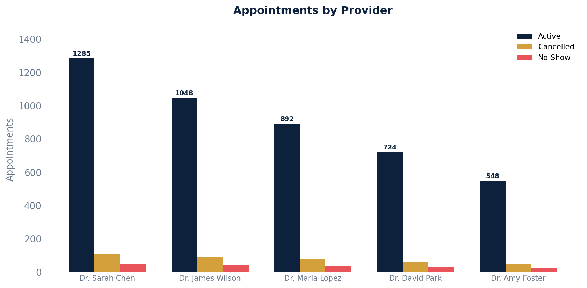

# Appointments by Provider

Provider-specific schedule analysis with counts by status and average appointment duration.

## SQL

```sql
SELECT
    s.id                                            AS provider_id,
    s.first_name || ' ' || s.last_name              AS provider_name,
    COUNT(*)                                         AS total_appointments,
    COUNT(*) FILTER (WHERE a.status NOT IN ('cancelled', 'noshowed')) AS active_appointments,
    COUNT(*) FILTER (WHERE a.status = 'cancelled')   AS cancelled,
    COUNT(*) FILTER (WHERE a.status = 'noshowed')    AS no_shows,
    ROUND(AVG(a.duration_minutes), 1)                AS avg_duration_minutes
FROM api_appointment a
JOIN api_staff s ON s.id = a.provider_id
WHERE a.entered_in_error_id IS NULL
GROUP BY s.id, s.first_name, s.last_name
ORDER BY total_appointments DESC;
```

## Columns Returned

| Column | Description |
|--------|-------------|
| `provider_id` | Internal staff ID |
| `provider_name` | Provider's full name |
| `total_appointments` | Total appointments for this provider |
| `active_appointments` | Non-cancelled, non-no-show appointments |
| `cancelled` | Cancelled appointments |
| `no_shows` | No-show appointments |
| `avg_duration_minutes` | Average appointment duration in minutes |

## Sample Output

*Synthetic data for illustration purposes.*

| Provider         | Total | Active | Cancelled | No-Shows | Avg Duration |
|------------------|------:|-------:|----------:|---------:|-------------:|
| Dr. Sarah Chen   | 1,441 |  1,285 |       108 |       48 |         24.5 |
| Dr. James Wilson | 1,182 |  1,048 |        92 |       42 |         28.2 |
| Dr. Maria Lopez  | 1,006 |    892 |        78 |       36 |         22.8 |
| Dr. David Park   |   814 |    724 |        62 |       28 |         26.1 |
| Dr. Amy Foster   |   618 |    548 |        48 |       22 |         20.4 |

### Visualization



## Notes

- Add `AND a.start_time >= '2024-01-01' AND a.start_time < '2025-01-01'` to filter by date range.
