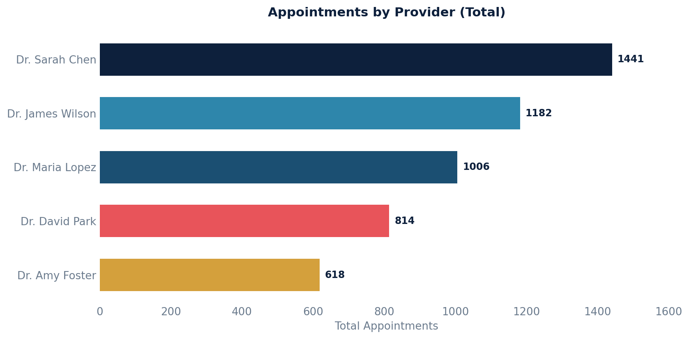

# Appointments

Retrieves appointment information, including associated note details, date of service, provider, and patient.

Excludes appointments that were entered in error.

## SQL

```sql
SELECT
    apt.externally_exposable_id AS apt_UUID,
    an.id AS appt_note_id,
    an.datetime_of_service AS appt_note_DOS,
    an.originator_id AS originated_by,
    st.first_name || ' ' || st.last_name AS note_provider,
    an.externally_exposable_id AS note_external_ID,
    ap.first_name || ' ' || ap.last_name AS patient_name,
    ap.key AS patient_key
FROM
    api_appointment apt
LEFT JOIN public.api_note an ON apt.note_id = an.id
LEFT JOIN public.api_staff st ON an.provider_id = st.id
LEFT JOIN public.api_patient ap ON an.patient_id = ap.id
WHERE
    apt.entered_in_error_id IS NULL;
```

## Columns Returned

| Column | Description |
|--------|-------------|
| `apt_UUID` | External UUID for the appointment |
| `appt_note_id` | Internal ID of the associated note |
| `appt_note_DOS` | Date of service from the note |
| `originated_by` | ID of the user who originated the note |
| `note_provider` | Provider's full name |
| `note_external_ID` | External UUID for the associated note |
| `patient_name` | Patient's full name |
| `patient_key` | Unique patient identifier |

## Sample Output

*Synthetic data for illustration purposes.*

| Apt UUID    | Note ID | DOS                 | Provider         | Patient        | Patient Key |
|-------------|--------:|---------------------|------------------|----------------|-------------|
| a1b2c3d4... |    5621 | 2026-02-20 09:00:00 | Dr. Sarah Chen   | Karen Adams    | PT-10042    |
| e5f6g7h8... |    5618 | 2026-02-20 09:30:00 | Dr. Sarah Chen   | Robert Chen    | PT-10038    |
| i9j0k1l2... |    5615 | 2026-02-20 10:00:00 | Dr. James Wilson | Maria Garcia   | PT-10035    |
| m3n4o5p6... |    5612 | 2026-02-19 14:00:00 | Dr. Maria Lopez  | David Johnson  | PT-10031    |
| q7r8s9t0... |         | 2026-02-19 15:00:00 | Dr. David Park   | Sarah Miller   | PT-10028    |

### Visualization


