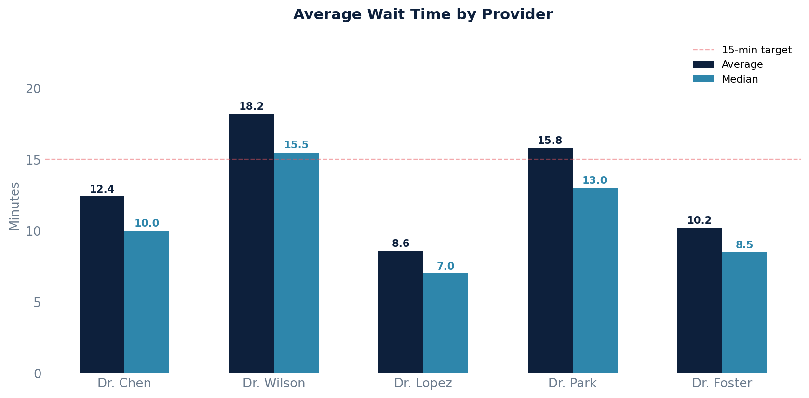

# Average Wait Time Report

Time from scheduled appointment start to when the encounter actually began, by provider, location, and month. Provides average, median, min, and max wait times.

## SQL

```sql
SELECT
    s.id                                AS provider_id,
    s.first_name || ' ' || s.last_name  AS provider_name,
    pl.full_name                        AS location_name,
    DATE_TRUNC('month', a.start_time)   AS month,
    COUNT(*)                            AS appointment_count,
    ROUND(AVG(
        EXTRACT(EPOCH FROM (e.start_time - a.start_time)) / 60.0
    )::numeric, 1)                      AS avg_wait_minutes,
    ROUND(PERCENTILE_CONT(0.5) WITHIN GROUP (
        ORDER BY EXTRACT(EPOCH FROM (e.start_time - a.start_time)) / 60.0
    )::numeric, 1)                      AS median_wait_minutes,
    ROUND(MIN(
        EXTRACT(EPOCH FROM (e.start_time - a.start_time)) / 60.0
    )::numeric, 1)                      AS min_wait_minutes,
    ROUND(MAX(
        EXTRACT(EPOCH FROM (e.start_time - a.start_time)) / 60.0
    )::numeric, 1)                      AS max_wait_minutes
FROM api_appointment a
JOIN api_staff s              ON s.id  = a.provider_id
JOIN api_practicelocation pl  ON pl.id = a.location_id
JOIN api_encounter e          ON e.note_id = a.note_id
WHERE a.entered_in_error_id IS NULL
  AND a.patient_id IS NOT NULL
  AND e.start_time IS NOT NULL
  AND e.state IN ('STA', 'CON')         -- started or concluded encounters
  AND e.start_time >= a.start_time       -- encounter started at or after scheduled time
  AND EXTRACT(EPOCH FROM (e.start_time - a.start_time)) / 60.0 BETWEEN 0 AND 480
      -- cap at 8 hours to exclude data anomalies
GROUP BY s.id, s.first_name, s.last_name, pl.full_name,
         DATE_TRUNC('month', a.start_time)
ORDER BY month DESC, avg_wait_minutes DESC;
```

## Columns Returned

| Column | Description |
|--------|-------------|
| `provider_id` | Internal staff ID |
| `provider_name` | Provider's full name |
| `location_name` | Practice location name |
| `month` | First day of the month |
| `appointment_count` | Number of appointments measured |
| `avg_wait_minutes` | Average wait time in minutes |
| `median_wait_minutes` | Median wait time in minutes |
| `min_wait_minutes` | Shortest wait time |
| `max_wait_minutes` | Longest wait time |

## Sample Output

*Synthetic data for illustration purposes.*

| Provider         | Location       | Month      | Appts | Avg Wait | Median | Min | Max  |
|------------------|----------------|------------|------:|---------:|-------:|----:|-----:|
| Dr. James Wilson | Main Street    | 2026-02-01 |    85 |     18.2 |   15.5 | 2.0 | 42.5 |
| Dr. David Park   | Downtown       | 2026-02-01 |    62 |     15.8 |   13.0 | 1.5 | 38.0 |
| Dr. Sarah Chen   | Main Street    | 2026-02-01 |    98 |     12.4 |   10.0 | 0.5 | 35.2 |
| Dr. Amy Foster   | North Campus   | 2026-02-01 |    48 |     10.2 |    8.5 | 1.0 | 28.0 |
| Dr. Maria Lopez  | Westside       | 2026-02-01 |    72 |      8.6 |    7.0 | 0.0 | 22.5 |

### Visualization



## Notes

- Wait time is measured as the gap between the scheduled appointment time and when the encounter actually started (provider began the visit).
- A cap of 8 hours (480 minutes) filters out outliers/data anomalies.
- Only started (`STA`) or concluded (`CON`) encounters are included.
- **Important:** Canvas does not store a separate "patient check-in timestamp." The appointment status field tracks states like "arrived" and "roomed," but those changes are not individually timestamped in a history table. The best available proxy for wait time is the difference between the scheduled time and the encounter start time.
