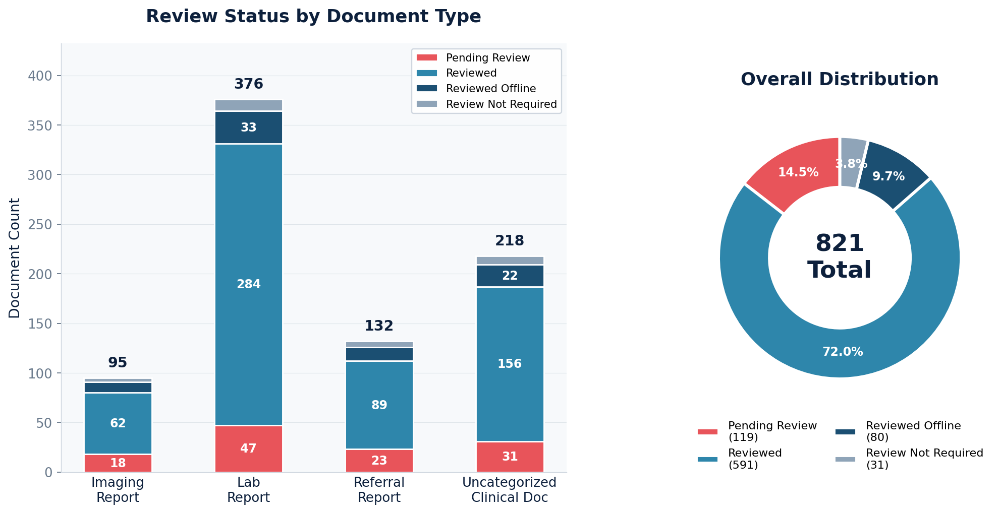

# Document Review Status

Reviewed vs. unreviewed counts for each document type, showing the distribution of review states across clinical documents, lab reports, imaging reports, and referral reports.

## SQL

```sql
SELECT
    source.document_type,
    source.review_status,
    COUNT(*) AS document_count
FROM (
    SELECT 'Uncategorized Clinical Document' AS document_type,
           CASE
               WHEN review_mode = 'RR' AND review_id IS NULL     THEN 'Pending Review'
               WHEN review_mode = 'RR' AND review_id IS NOT NULL THEN 'Reviewed'
               WHEN review_mode = 'AR'                           THEN 'Reviewed Offline'
               WHEN review_mode = 'RN'                           THEN 'Review Not Required'
           END AS review_status
    FROM api_uncategorizedclinicaldocument
    WHERE junked = FALSE

    UNION ALL

    SELECT 'Referral Report',
           CASE
               WHEN review_mode = 'RR' AND review_id IS NULL     THEN 'Pending Review'
               WHEN review_mode = 'RR' AND review_id IS NOT NULL THEN 'Reviewed'
               WHEN review_mode = 'AR'                           THEN 'Reviewed Offline'
               WHEN review_mode = 'RN'                           THEN 'Review Not Required'
           END
    FROM api_referralreport
    WHERE junked = FALSE

    UNION ALL

    SELECT 'Lab Report',
           CASE
               WHEN review_mode = 'RR' AND review_id IS NULL     THEN 'Pending Review'
               WHEN review_mode = 'RR' AND review_id IS NOT NULL THEN 'Reviewed'
               WHEN review_mode = 'AR'                           THEN 'Reviewed Offline'
               WHEN review_mode = 'RN'                           THEN 'Review Not Required'
           END
    FROM api_labreport
    WHERE junked = FALSE AND deleted = FALSE

    UNION ALL

    SELECT 'Imaging Report',
           CASE
               WHEN review_mode = 'RR' AND review_id IS NULL     THEN 'Pending Review'
               WHEN review_mode = 'RR' AND review_id IS NOT NULL THEN 'Reviewed'
               WHEN review_mode = 'AR'                           THEN 'Reviewed Offline'
               WHEN review_mode = 'RN'                           THEN 'Review Not Required'
           END
    FROM api_imagingreport
    WHERE junked = FALSE
) source
GROUP BY source.document_type, source.review_status
ORDER BY source.document_type, source.review_status;
```

## Columns Returned

| Column | Description |
|--------|-------------|
| `document_type` | Type of document (Uncategorized Clinical Document, Referral Report, Lab Report, Imaging Report) |
| `review_status` | Review state (Pending Review, Reviewed, Reviewed Offline, Review Not Required) |
| `document_count` | Number of documents in this state |

## Review Mode Reference

| Code | Status | Meaning |
|------|--------|---------|
| `RR` | Review Required | Document needs provider review |
| `AR` | Already Reviewed | Reviewed outside of Canvas (e.g., paper review) |
| `RN` | Review Not Required | No review needed |

## Sample Output

*Synthetic data for illustration purposes.*

| Document Type                   | Review Status        | Count |
|---------------------------------|----------------------|------:|
| Imaging Report                  | Pending Review       |    18 |
| Imaging Report                  | Review Not Required  |     4 |
| Imaging Report                  | Reviewed             |    62 |
| Imaging Report                  | Reviewed Offline     |    11 |
| Lab Report                      | Pending Review       |    47 |
| Lab Report                      | Review Not Required  |    12 |
| Lab Report                      | Reviewed             |   284 |
| Lab Report                      | Reviewed Offline     |    33 |
| Referral Report                 | Pending Review       |    23 |
| Referral Report                 | Review Not Required  |     6 |
| Referral Report                 | Reviewed             |    89 |
| Referral Report                 | Reviewed Offline     |    14 |
| Uncategorized Clinical Document | Pending Review       |    31 |
| Uncategorized Clinical Document | Review Not Required  |     9 |
| Uncategorized Clinical Document | Reviewed             |   156 |
| Uncategorized Clinical Document | Reviewed Offline     |    22 |

### Summary by Review Status

| Review Status        | Total | % of All |
|----------------------|------:|---------:|
| Pending Review       |   119 |    14.5% |
| Reviewed             |   591 |    72.0% |
| Reviewed Offline     |    80 |     9.7% |
| Review Not Required  |    31 |     3.8% |
| **TOTAL**            |   821 |   100.0% |

### Visualization



## Notes

- Within `review_mode = 'RR'`, the presence of a `review_id` distinguishes "Pending Review" (no review yet) from "Reviewed" (review completed).
- Junked and deleted documents are excluded.
