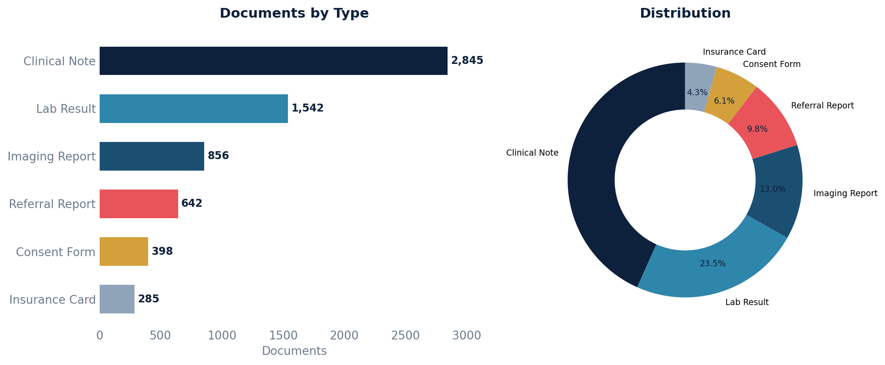

# Documents by Type

Counts of documents broken down by type and category as recorded in the document reference table, with date ranges.

## SQL

```sql
SELECT
    drt.display                   AS document_type,
    COALESCE(drc.display, 'N/A')  AS document_category,
    COUNT(*)                      AS document_count,
    MIN(dr.date)                  AS earliest_date,
    MAX(dr.date)                  AS latest_date
FROM api_documentreference dr
JOIN api_documentreferencecoding   drt ON drt.id = dr.type_id
LEFT JOIN api_documentreferencecategory drc ON drc.id = dr.category_id
WHERE dr.status = 'current'
GROUP BY drt.display, drc.display
ORDER BY document_count DESC;
```

## Columns Returned

| Column | Description |
|--------|-------------|
| `document_type` | Document type display name |
| `document_category` | Document category display name (or N/A if uncategorized) |
| `document_count` | Number of documents of this type/category |
| `earliest_date` | Date of the oldest document in this group |
| `latest_date` | Date of the most recent document in this group |

## Sample Output

*Synthetic data for illustration purposes.*

| Document Type    | Category        | Count | Earliest   | Latest     |
|------------------|-----------------|------:|------------|------------|
| Clinical Note    | Progress Note   | 2,845 | 2023-01-04 | 2026-02-20 |
| Lab Result       | Laboratory      | 1,542 | 2023-02-15 | 2026-02-19 |
| Imaging Report   | Radiology       |   856 | 2023-06-22 | 2026-02-18 |
| Referral Report  | Specialty       |   642 | 2023-08-10 | 2026-02-17 |
| Consent Form     | Administrative  |   398 | 2024-01-05 | 2026-02-15 |
| Insurance Card   | N/A             |   285 | 2024-03-12 | 2026-02-14 |

### Visualization



## Notes

- Only documents with status `'current'` are included (excludes superseded or entered-in-error records).
- Categories are optional — documents without a category show as "N/A."
