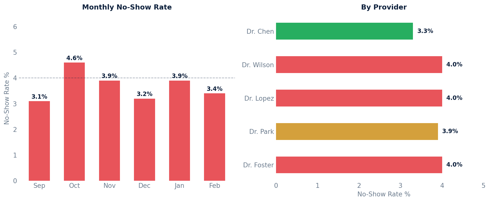

# No-Show Report

No-show rates by provider and location, broken down by month.

## SQL

```sql
SELECT
    s.id                          AS provider_id,
    s.first_name || ' ' || s.last_name AS provider_name,
    pl.full_name                  AS location_name,
    DATE_TRUNC('month', a.start_time) AS month,
    COUNT(*)                      AS total_appointments,
    COUNT(*) FILTER (WHERE latest_state.state = 'NSW')
                                  AS no_show_count,
    ROUND(
        100.0 * COUNT(*) FILTER (WHERE latest_state.state = 'NSW')
              / NULLIF(COUNT(*), 0),
        2
    )                             AS no_show_rate_pct
FROM api_appointment a
JOIN api_staff s              ON s.id  = a.provider_id
JOIN api_practicelocation pl  ON pl.id = a.location_id
LEFT JOIN LATERAL (
    SELECT nse.state
    FROM api_notestatechangeevent nse
    WHERE nse.note_id = a.note_id
    ORDER BY nse.created DESC, nse.id DESC
    LIMIT 1
) latest_state ON TRUE
WHERE a.entered_in_error_id IS NULL
  AND a.patient_id IS NOT NULL          -- only patient-facing appointments
  AND a.start_time < NOW()              -- only past appointments
GROUP BY s.id, s.first_name, s.last_name, pl.full_name,
         DATE_TRUNC('month', a.start_time)
ORDER BY month DESC, no_show_rate_pct DESC NULLS LAST;
```

## Columns Returned

| Column | Description |
|--------|-------------|
| `provider_id` | Internal staff ID |
| `provider_name` | Provider's full name |
| `location_name` | Practice location name |
| `month` | First day of the month |
| `total_appointments` | Total past patient-facing appointments |
| `no_show_count` | Number of no-show appointments |
| `no_show_rate_pct` | No-show rate as a percentage |

## Sample Output

*Synthetic data for illustration purposes.*

| Provider         | Location       | Month      | Total | No-Shows | Rate   |
|------------------|----------------|------------|------:|---------:|-------:|
| Dr. James Wilson | Main Street    | 2026-02-01 |    85 |        4 |  4.71% |
| Dr. David Park   | North Campus   | 2026-02-01 |    62 |        3 |  4.84% |
| Dr. Sarah Chen   | Main Street    | 2026-02-01 |    98 |        3 |  3.06% |
| Dr. Maria Lopez  | Westside       | 2026-02-01 |    72 |        3 |  4.17% |
| Dr. Amy Foster   | Downtown       | 2026-02-01 |    48 |        2 |  4.17% |

### Visualization



## Notes

- No-shows are identified by the most recent note state change event being `'NSW'` (No-Show).
- Only past, patient-facing appointments are included.
