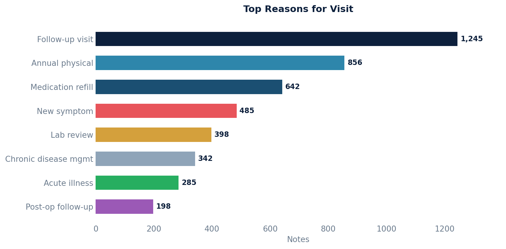

# Notes with Structured Reason for Visit

Retrieves patient note details with provider information and structured reason-for-visit (RFV) coding.

Results are sorted by most recent date of service first.

## SQL

```sql
SELECT
    'https://<instancename>.canvasmedical.com/patient/' || ap.key AS patient_link,
    ap.first_name || ' ' || ap.last_name AS patient_name,
    ap.birth_date AS patient_dob,
    n.datetime_of_service AS note_dos_utc,
    n.id AS note_id,
    n.externally_exposable_id AS note_uuid,
    st.first_name || ' ' || st.last_name AS note_provider,
    a.system AS rfv_codesystem,
    a.code AS rfv_code,
    a.display AS rfv_display
FROM public.api_note n
LEFT JOIN public.api_reasonforvisit ar ON n.id = ar.note_id
LEFT JOIN public.api_reasonforvisitcoding a ON ar.id = a.reason_for_visit_id
LEFT JOIN public.api_patient ap ON n.patient_id = ap.id
LEFT JOIN public.api_staff st ON n.provider_id = st.id
ORDER BY n.datetime_of_service DESC;
```

## Columns Returned

| Column | Description |
|--------|-------------|
| `patient_link` | Direct URL to the patient's chart (replace `<instancename>` with your Canvas instance name) |
| `patient_name` | Patient's full name |
| `patient_dob` | Patient's date of birth |
| `note_dos_utc` | Date of service (UTC) |
| `note_id` | Internal note identifier |
| `note_uuid` | External UUID for the note |
| `note_provider` | Provider's full name |
| `rfv_codesystem` | Code system for the reason for visit |
| `rfv_code` | Reason for visit code |
| `rfv_display` | Display text for the reason for visit |

## Sample Output

*Synthetic data for illustration purposes.*

| Patient Link          | Patient        | DOB        | DOS                 | Note ID | Provider         | RFV System | RFV Code | RFV Display      |
|-----------------------|----------------|------------|---------------------|--------:|------------------|------------|----------|------------------|
| https://.../ PT-10042 | Karen Adams    | 1985-03-14 | 2026-02-20 09:00:00 |    5621 | Dr. Sarah Chen   | ICD-10     | Z00.00   | General exam     |
| https://.../ PT-10038 | Robert Chen    | 1952-11-22 | 2026-02-19 14:00:00 |    5618 | Dr. James Wilson | SNOMED     | 185345009| Follow-up visit  |
| https://.../ PT-10035 | Maria Garcia   | 1990-07-08 | 2026-02-18 10:00:00 |    5615 | Dr. Maria Lopez  | ICD-10     | R05.9    | Cough            |
| https://.../ PT-10031 | David Johnson  | 1968-01-30 | 2026-02-17 11:00:00 |    5612 | Dr. David Park   | SNOMED     | 410429000| Medication review|

### Visualization



## Notes

- Replace `<instancename>` in the `patient_link` column with your actual Canvas Medical instance name.
- Notes without a structured reason for visit will show NULL in the RFV columns.
- You can uncomment the WHERE clause examples in the SQL file to filter by date range or provider.
