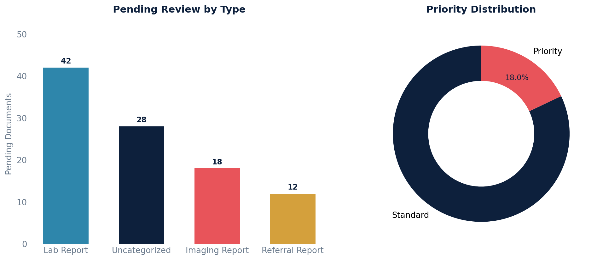

# Pending Documents Report

Lists uncategorized clinical documents, lab results, imaging reports, and referral/consult reports that still need provider review.

## SQL

```sql
SELECT
    source.document_type,
    source.document_id,
    source.document_name,
    source.original_date,
    source.uploaded_date,
    source.priority,
    p.first_name || ' ' || p.last_name AS patient_name,
    p.key                                AS patient_key
FROM (
    /* Uncategorized Clinical Documents */
    SELECT 'Uncategorized Clinical Document' AS document_type,
           id AS document_id,
           name AS document_name,
           original_date,
           created AS uploaded_date,
           priority,
           patient_id
    FROM   api_uncategorizedclinicaldocument
    WHERE  junked = FALSE
      AND  review_mode = 'RR'
      AND  review_id IS NULL

    UNION ALL

    /* Referral / Consult Reports */
    SELECT 'Referral Report',
           id, specialty, original_date, created, priority, patient_id
    FROM   api_referralreport
    WHERE  junked = FALSE
      AND  review_mode = 'RR'
      AND  review_id IS NULL

    UNION ALL

    /* Lab Reports */
    SELECT 'Lab Report',
           id,
           COALESCE(NULLIF(custom_document_name,''), 'Lab Report'),
           original_date::date,
           created,
           FALSE,
           patient_id
    FROM   api_labreport
    WHERE  junked = FALSE
      AND  deleted = FALSE
      AND  review_mode = 'RR'
      AND  review_id IS NULL

    UNION ALL

    /* Imaging Reports */
    SELECT 'Imaging Report',
           id, name, original_date, created, FALSE, patient_id
    FROM   api_imagingreport
    WHERE  junked = FALSE
      AND  review_mode = 'RR'
      AND  review_id IS NULL
) source
JOIN api_patient p ON p.id = source.patient_id
ORDER BY source.priority DESC, source.uploaded_date ASC;
```

## Columns Returned

| Column | Description |
|--------|-------------|
| `document_type` | Type of document (Uncategorized Clinical Document, Referral Report, Lab Report, Imaging Report) |
| `document_id` | Internal document ID |
| `document_name` | Document name or specialty (varies by type) |
| `original_date` | Original date of the document |
| `uploaded_date` | Date the document was uploaded/created in Canvas |
| `priority` | Priority flag (TRUE/FALSE) |
| `patient_name` | Patient's full name |
| `patient_key` | Patient MRN / external key |

## Sample Output

*Synthetic data for illustration purposes.*

| Type                      | ID   | Name                   | Original   | Uploaded   | Priority | Patient        | Key      |
|---------------------------|-----:|------------------------|------------|------------|:--------:|----------------|----------|
| Lab Report                | 3245 | CBC with Differential  | 2026-02-18 | 2026-02-19 | FALSE    | Karen Adams    | PT-10042 |
| Lab Report                | 3242 | Comprehensive Metabolic| 2026-02-17 | 2026-02-18 | TRUE     | Robert Chen    | PT-10038 |
| Uncategorized Clinical Doc| 3240 | Scanned document       | 2026-02-15 | 2026-02-16 | FALSE    | Maria Garcia   | PT-10035 |
| Imaging Report            | 3238 | Chest X-Ray            | 2026-02-14 | 2026-02-15 | FALSE    | David Johnson  | PT-10031 |
| Referral Report           | 3235 | Cardiology Consult     | 2026-02-12 | 2026-02-13 | TRUE     | James Park     | PT-10024 |

### Visualization



## Notes

- A document is "pending review" when `review_mode = 'RR'` (Review Required) and no review record is linked (`review_id IS NULL`).
- Junked documents are excluded.
- Results are ordered by priority (high priority first), then oldest upload date first.
