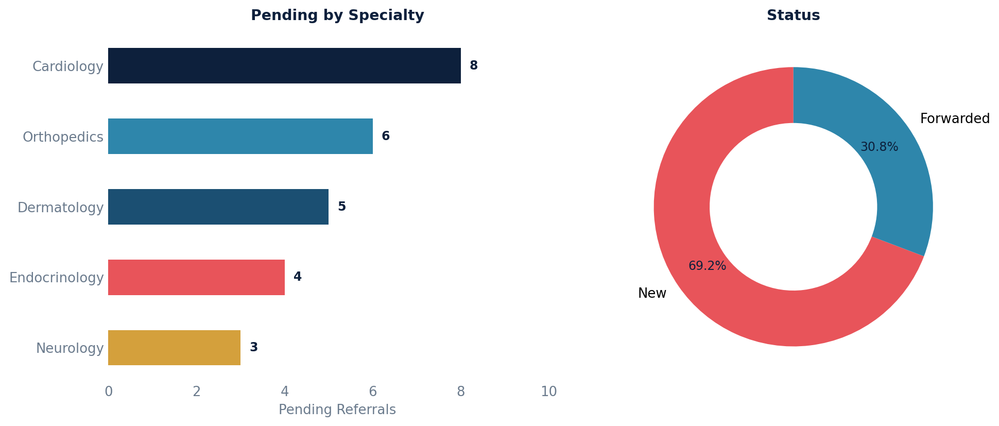

# Pending Referrals Report

Outgoing referrals that have not yet been committed (finalized) by the provider. Includes specialist details, clinical question, priority, and fax delivery status.

## SQL

```sql
SELECT
    r.id                                      AS referral_id,
    p.first_name || ' ' || p.last_name        AS patient_name,
    p.key                                     AS patient_key,
    sp.first_name || ' ' || sp.last_name      AS specialist_name,
    sp.specialty,
    sp.practice_name,
    r.clinical_question,
    r.priority,
    r.date_referred,
    r.notes,
    CASE
        WHEN r.forwarded = TRUE THEN 'Forwarded'
        ELSE 'New'
    END                                       AS referral_status,
    ae.latest_fax_event,
    ae.fax_delivered
FROM api_referral r
JOIN api_patient p ON p.id = r.patient_id
LEFT JOIN data_integration_serviceprovider sp ON sp.id = r.service_provider_id
LEFT JOIN LATERAL (
    SELECT MAX(e.created)      AS latest_fax_event,
           bool_or(e.delivered_by_fax) AS fax_delivered
    FROM   api_referralactionevent e
    WHERE  e.referral_id = r.id
) ae ON TRUE
WHERE r.deleted = FALSE
  AND r.entered_in_error_id IS NULL
  AND r.committer_id IS NULL
ORDER BY r.date_referred DESC;
```

## Columns Returned

| Column | Description |
|--------|-------------|
| `referral_id` | Internal referral ID |
| `patient_name` | Patient's full name |
| `patient_key` | Patient MRN / external key |
| `specialist_name` | Referred-to specialist's full name |
| `specialty` | Specialist's specialty |
| `practice_name` | Specialist's practice name |
| `clinical_question` | Clinical question or reason for the referral |
| `priority` | Referral priority |
| `date_referred` | Date the referral was created |
| `notes` | Free-text notes on the referral |
| `referral_status` | Derived status: "New" (not yet forwarded) or "Forwarded" (sent but not finalized) |
| `latest_fax_event` | Timestamp of the most recent fax action event |
| `fax_delivered` | Whether the referral was successfully delivered by fax (TRUE/FALSE) |

## Sample Output

*Synthetic data for illustration purposes.*

| Ref ID | Patient        | Key      | Specialist        | Specialty    | Practice            | Priority | Date       | Status    | Fax |
|-------:|----------------|----------|-------------------|-------------|---------------------|----------|------------|-----------|:---:|
|    245 | Karen Adams    | PT-10042 | Dr. Kim, John     | Cardiology  | Heart Center        | Routine  | 2026-02-18 | New       |     |
|    242 | Robert Chen    | PT-10038 | Dr. Patel, Anita  | Orthopedics | Joint Specialists   | Urgent   | 2026-02-15 | Forwarded | Yes |
|    240 | Maria Garcia   | PT-10035 | Dr. Lee, Susan    | Dermatology | Skin Care Clinic    | Routine  | 2026-02-12 | New       |     |
|    238 | David Johnson  | PT-10031 | Dr. Nguyen, Tran  | Endocrinology| Diabetes Center    | Routine  | 2026-02-10 | Forwarded | No  |

### Visualization



## Notes

- A referral is considered "pending" when `committer_id IS NULL` (not yet finalized by the provider).
- Status is derived: **New** = not forwarded and not committed; **Forwarded** = sent to specialist but not yet committed.
- Deleted and entered-in-error referrals are excluded.
