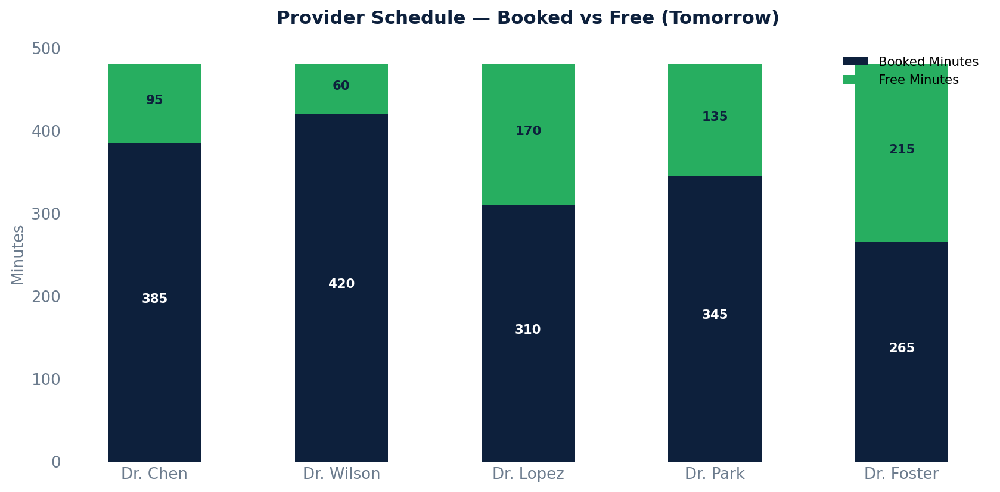

# Provider Schedule Availability

A forward-looking estimate of how much time each provider has booked vs. free per day. Assumes an 8-hour working day (480 minutes) — adjust as needed.

## SQL

```sql
SELECT
    s.id                                             AS provider_id,
    s.first_name || ' ' || s.last_name               AS provider_name,
    DATE(a.start_time)                               AS appointment_date,
    COUNT(*)                                         AS booked_appointments,
    SUM(a.duration_minutes)                          AS booked_minutes,
    GREATEST(480 - SUM(a.duration_minutes), 0)       AS estimated_free_minutes
FROM api_appointment a
JOIN api_staff s ON s.id = a.provider_id
WHERE a.entered_in_error_id IS NULL
  AND a.status NOT IN ('cancelled', 'noshowed')
  AND a.start_time >= CURRENT_DATE
GROUP BY s.id, s.first_name, s.last_name, DATE(a.start_time)
ORDER BY appointment_date, provider_name;
```

## Columns Returned

| Column | Description |
|--------|-------------|
| `provider_id` | Internal staff ID |
| `provider_name` | Provider's full name |
| `appointment_date` | Date of the appointments |
| `booked_appointments` | Number of booked appointments that day |
| `booked_minutes` | Total booked minutes |
| `estimated_free_minutes` | Estimated free time remaining (480 minus booked, minimum 0) |

## Sample Output

*Synthetic data for illustration purposes.*

| Provider         | Date       | Booked Appts | Booked Min | Free Min |
|------------------|------------|------------:|-----------:|---------:|
| Dr. Sarah Chen   | 2026-02-21 |          14 |        385 |       95 |
| Dr. James Wilson | 2026-02-21 |          16 |        420 |       60 |
| Dr. Maria Lopez  | 2026-02-21 |          12 |        310 |      170 |
| Dr. David Park   | 2026-02-21 |          13 |        345 |      135 |
| Dr. Amy Foster   | 2026-02-21 |          10 |        265 |      215 |

### Visualization



## Notes

- Canvas does not store provider schedule templates (available hours) in a dedicated table, so "free minutes" is estimated by subtracting booked time from a configurable workday length.
- Adjust `480` to match your providers' actual scheduled hours.
- Only future dates are included (`start_time >= CURRENT_DATE`).
- Cancelled and no-show appointments are excluded.
