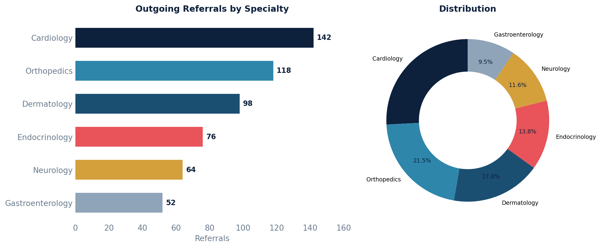

# Referral Source Report

Outgoing referrals grouped by specialist and specialty, showing which specialists patients are referred to most often along with pending vs. completed counts.

## SQL

```sql
SELECT
    COALESCE(sp.specialty, 'Unknown')                     AS specialty,
    COALESCE(sp.first_name || ' ' || sp.last_name, 'N/A') AS specialist_name,
    COALESCE(sp.practice_name, 'N/A')                     AS practice_name,
    COUNT(*)                                               AS total_referrals,
    COUNT(*) FILTER (WHERE r.committer_id IS NULL)         AS pending,
    COUNT(*) FILTER (WHERE r.committer_id IS NOT NULL)     AS completed
FROM api_referral r
LEFT JOIN data_integration_serviceprovider sp ON sp.id = r.service_provider_id
WHERE r.deleted = FALSE
  AND r.entered_in_error_id IS NULL
GROUP BY sp.specialty, sp.first_name, sp.last_name, sp.practice_name
ORDER BY total_referrals DESC;
```

## Columns Returned

| Column | Description |
|--------|-------------|
| `specialty` | Specialist's specialty (or "Unknown" if not recorded) |
| `specialist_name` | Specialist's full name (or "N/A") |
| `practice_name` | Specialist's practice name (or "N/A") |
| `total_referrals` | Total referrals to this specialist |
| `pending` | Referrals not yet committed (finalized) |
| `completed` | Referrals that have been committed |

## Sample Output

*Synthetic data for illustration purposes.*

| Specialty        | Specialist        | Practice            | Total | Pending | Completed |
|------------------|-------------------|---------------------|------:|--------:|----------:|
| Cardiology       | Dr. Kim, John     | Heart Center        |   142 |       8 |       134 |
| Orthopedics      | Dr. Patel, Anita  | Joint Specialists   |   118 |       6 |       112 |
| Dermatology      | Dr. Lee, Susan    | Skin Care Clinic    |    98 |       5 |        93 |
| Endocrinology    | Dr. Nguyen, Tran  | Diabetes Center     |    76 |       4 |        72 |
| Neurology        | Dr. Brown, Michael| Neuro Associates    |    64 |       3 |        61 |

### Visualization



## Notes

- **Important:** Canvas does not store a "referral source" field on patients (e.g., "referred by Dr. Smith" or "found us on Google"). There is no table or column tracking where new patients were referred *from*. This report shows **outgoing** referral patterns — which specialists your practice refers patients **to**.
- If you track incoming referral sources via a custom field or intake questionnaire, a tailored query against those fields would be needed.
