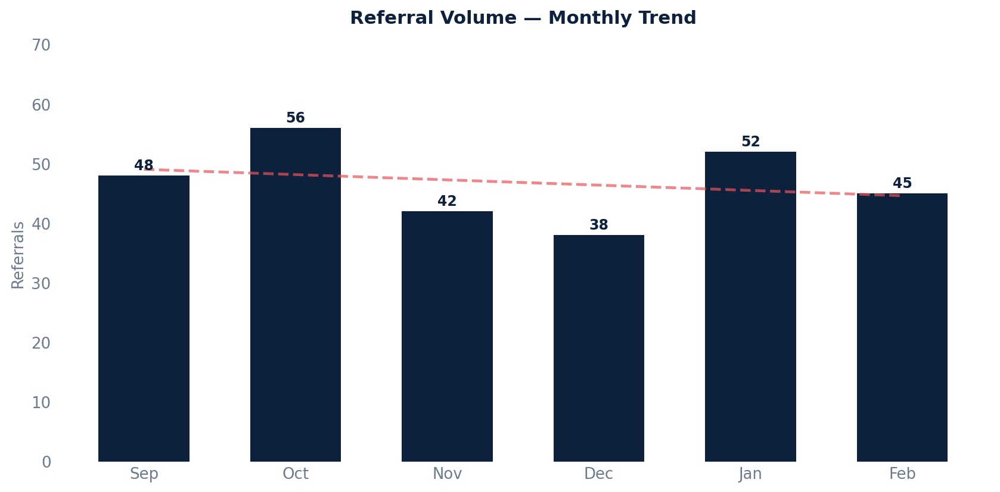

# Referrals

Retrieves referral details, including patient information and referred-to provider details.

Filters out test patients, referrals entered in error, deleted referrals, uncommitted drafts, and referrals created by Canvas Support.

## SQL

```sql
SELECT
    DATE(ar.date_referred) AS referral_date,
    ar.clinical_question AS clinical_question,
    ar.priority AS referral_priority,
    ar.notes AS referral_notes,
    ap.mrn AS patient_mrn,
    ap.key AS patient_key,
    ap.first_name || ' ' || ap.last_name AS patient_name,
    dis.first_name || ' ' || dis.last_name AS referred_to_name,
    dis.practice_name AS referred_to_practice,
    dis.specialty AS referred_to_speciality
FROM
    api_referral ar
LEFT JOIN public.api_patient ap ON ar.patient_id = ap.id
LEFT JOIN public.data_integration_serviceprovider dis ON ar.service_provider_id = dis.id
WHERE
    ar.originator_id != 2
    AND ar.entered_in_error_id IS NULL
    AND ar.deleted = 'false'
    AND ar.committer_id IS NOT NULL
    AND ap.last_name NOT LIKE '%zztest%'
ORDER BY
    DATE(ar.created) DESC;
```

## Columns Returned

| Column | Description |
|--------|-------------|
| `referral_date` | Date the referral was made |
| `clinical_question` | The clinical question or reason for the referral |
| `referral_priority` | Priority level of the referral |
| `referral_notes` | Additional notes on the referral |
| `patient_mrn` | Patient's medical record number |
| `patient_key` | Unique patient identifier |
| `patient_name` | Patient's full name |
| `referred_to_name` | Name of the provider being referred to |
| `referred_to_practice` | Practice name of the referred-to provider |
| `referred_to_speciality` | Specialty of the referred-to provider |

## Sample Output

*Synthetic data for illustration purposes.*

| Date       | Clinical Question                  | Priority | Patient        | MRN    | Referred To       | Practice            | Specialty    |
|------------|-----------------------------------|----------|----------------|--------|-------------------|---------------------|-------------|
| 2026-02-18 | Evaluate chest pain on exertion   | Urgent   | Karen Adams    | 100042 | Dr. Kim, John     | Heart Center        | Cardiology  |
| 2026-02-15 | R knee pain, MRI recommended      | Routine  | Robert Chen    | 100038 | Dr. Patel, Anita  | Joint Specialists   | Orthopedics |
| 2026-02-12 | Persistent rash, unresponsive     | Routine  | Maria Garcia   | 100035 | Dr. Lee, Susan    | Skin Care Clinic    | Dermatology |
| 2026-02-10 | Poorly controlled A1c, needs mgmt | Routine  | David Johnson  | 100031 | Dr. Nguyen, Tran  | Diabetes Center     | Endocrinology|

### Visualization



## Notes

- Referrals created by Canvas Support (originator_id = 2) are excluded.
- Test patients (last name containing "zztest") are excluded.
- Results are sorted by creation date, most recent first.
