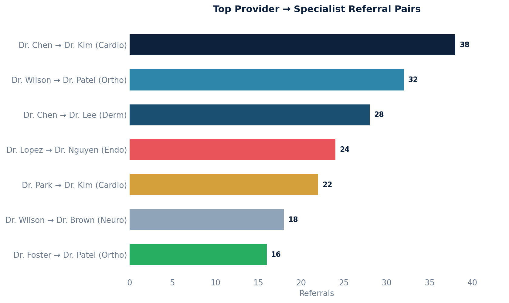

# Specialist Referral Patterns

Shows which specialists each provider refers to most often, with referral counts and date ranges. Useful for understanding provider referral networks.

## SQL

```sql
SELECT
    provider.first_name || ' ' || provider.last_name       AS referring_provider,
    COALESCE(sp.specialty, 'Unknown')                      AS specialist_specialty,
    COALESCE(sp.first_name || ' ' || sp.last_name, 'N/A') AS specialist_name,
    COALESCE(sp.practice_name, 'N/A')                      AS practice_name,
    COUNT(*)                                                AS referral_count,
    MIN(r.date_referred)                                   AS first_referral,
    MAX(r.date_referred)                                   AS most_recent_referral
FROM api_referral r
JOIN api_note n            ON n.id = r.note_id
JOIN api_staff provider    ON provider.id = n.provider_id
LEFT JOIN data_integration_serviceprovider sp ON sp.id = r.service_provider_id
WHERE r.deleted = FALSE
  AND r.entered_in_error_id IS NULL
GROUP BY provider.first_name, provider.last_name,
         sp.specialty, sp.first_name, sp.last_name, sp.practice_name
ORDER BY referring_provider, referral_count DESC;
```

## Columns Returned

| Column | Description |
|--------|-------------|
| `referring_provider` | The provider who created the referral |
| `specialist_specialty` | Specialist's specialty (or "Unknown") |
| `specialist_name` | Specialist's full name (or "N/A") |
| `practice_name` | Specialist's practice name (or "N/A") |
| `referral_count` | Number of referrals from this provider to this specialist |
| `first_referral` | Date of the earliest referral in this pair |
| `most_recent_referral` | Date of the most recent referral in this pair |

## Sample Output

*Synthetic data for illustration purposes.*

| Referring Provider | Specialty     | Specialist        | Practice          | Count | First      | Most Recent |
|-------------------|---------------|-------------------|-------------------|------:|------------|-------------|
| Dr. Sarah Chen    | Cardiology    | Dr. Kim, John     | Heart Center      |    38 | 2024-03-15 | 2026-02-18  |
| Dr. James Wilson  | Orthopedics   | Dr. Patel, Anita  | Joint Specialists |    32 | 2024-05-22 | 2026-02-15  |
| Dr. Sarah Chen    | Dermatology   | Dr. Lee, Susan    | Skin Care Clinic  |    28 | 2024-06-10 | 2026-02-12  |
| Dr. Maria Lopez   | Endocrinology | Dr. Nguyen, Tran  | Diabetes Center   |    24 | 2024-08-05 | 2026-02-10  |
| Dr. David Park    | Cardiology    | Dr. Kim, John     | Heart Center      |    22 | 2024-09-18 | 2026-02-08  |

### Visualization



## Notes

- The referring provider is identified via the clinical note associated with the referral (`api_note.provider_id`).
- Specialists are stored in the `data_integration_serviceprovider` table.
- Deleted and entered-in-error referrals are excluded.
