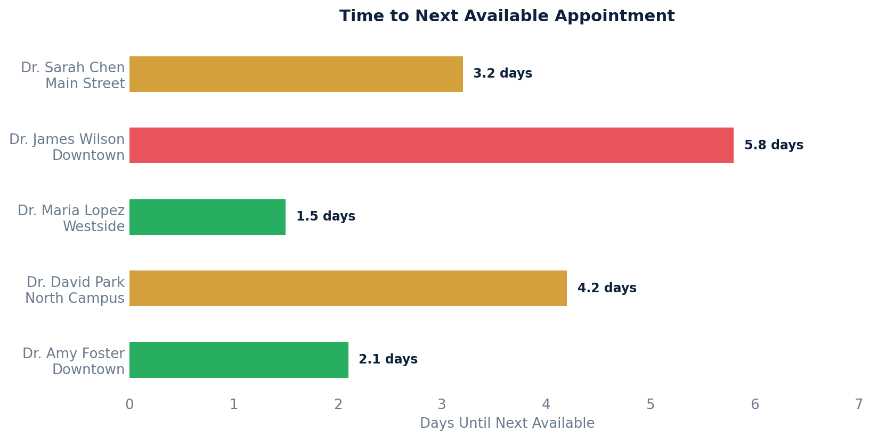

# Time to Next Available Appointment

Access metrics showing how many days until the next open appointment slot per provider and location.

## SQL

```sql
SELECT
    s.id                                AS provider_id,
    s.first_name || ' ' || s.last_name  AS provider_name,
    pl.full_name                        AS location_name,
    MIN(a.start_time)                   AS next_available_slot,
    ROUND(
        EXTRACT(EPOCH FROM (MIN(a.start_time) - NOW())) / 86400.0, 1
    )                                   AS days_until_available
FROM api_appointment a
JOIN api_staff s              ON s.id  = a.provider_id
JOIN api_practicelocation pl  ON pl.id = a.location_id
LEFT JOIN LATERAL (
    SELECT nse.state
    FROM api_notestatechangeevent nse
    WHERE nse.note_id = a.note_id
    ORDER BY nse.created DESC, nse.id DESC
    LIMIT 1
) latest_state ON TRUE
WHERE a.entered_in_error_id IS NULL
  AND a.start_time > NOW()                  -- future only
  AND a.patient_id IS NULL                  -- open / unbooked slots
  AND (latest_state.state IS NULL
       OR latest_state.state NOT IN ('CLD', 'DLT', 'NSW'))
GROUP BY s.id, s.first_name, s.last_name, pl.full_name
ORDER BY provider_name, location_name;
```

## Columns Returned

| Column | Description |
|--------|-------------|
| `provider_id` | Internal staff ID |
| `provider_name` | Provider's full name |
| `location_name` | Practice location name |
| `next_available_slot` | Date/time of the earliest open appointment slot |
| `days_until_available` | Number of days from now until that slot |

## Sample Output

*Synthetic data for illustration purposes.*

| Provider         | Location       | Next Slot           | Days |
|------------------|----------------|---------------------|-----:|
| Dr. Maria Lopez  | Westside       | 2026-02-22 09:00:00 |  1.5 |
| Dr. Amy Foster   | Downtown       | 2026-02-22 14:00:00 |  2.1 |
| Dr. Sarah Chen   | Main Street    | 2026-02-23 10:30:00 |  3.2 |
| Dr. David Park   | North Campus   | 2026-02-24 11:00:00 |  4.2 |
| Dr. James Wilson | Downtown       | 2026-02-26 09:00:00 |  5.8 |

### Visualization



## Notes

- This looks for future appointment slots with no patient assigned (open/available).
- Cancelled, deleted, and no-show slots are excluded.
- **Important caveat:** This approach only works if your practice creates placeholder appointment slots for availability. If your scheduling model relies on provider availability blocks rather than pre-created open slots, this query would need to be adapted.
