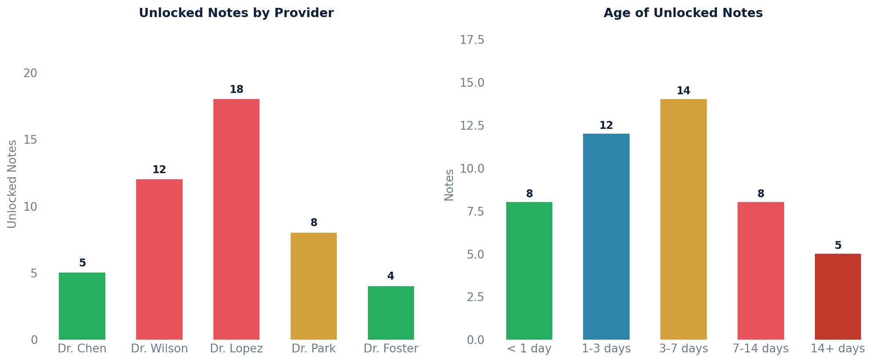

# Unlocked Notes

Retrieves all unlocked notes with a date of service before today, including creation date, service date, note state, practice location, originator, and provider details.

Useful for identifying notes that still need to be signed/locked.

## SQL

```sql
SELECT
    n.created AS note_created,
    n.datetime_of_service,
    nsc.state AS note_state,
    pl.full_name AS practice_location,
    s1.first_name || ' ' || s1.last_name AS originator_name,
    s2.first_name || ' ' || s2.last_name AS provider_name
FROM
    api_note n
JOIN (
    SELECT
        MAX(id) AS max_id,
        note_id
    FROM
        api_notestatechangeevent
    GROUP BY
        note_id
) max_nsc ON max_nsc.note_id = n.id
JOIN api_notestatechangeevent nsc ON nsc.id = max_nsc.max_id
JOIN api_practicelocation pl ON pl.id = n.location_id
JOIN api_staff s1 ON s1.user_id = n.originator_id
JOIN api_staff s2 ON s2.id = n.provider_id
JOIN api_patient p ON p.id = n.patient_id
WHERE
    n.datetime_of_service < current_date
    AND nsc.state NOT IN ('DLT', 'LKD', 'CLD');
```

## Columns Returned

| Column | Description |
|--------|-------------|
| `note_created` | Timestamp when the note was created |
| `datetime_of_service` | Date of service for the note |
| `note_state` | Current state of the note (excludes DLT, LKD, CLD) |
| `practice_location` | Name of the practice location |
| `originator_name` | Name of the staff member who originated the note |
| `provider_name` | Name of the provider on the note |

## Sample Output

*Synthetic data for illustration purposes.*

| Created             | DOS        | State | Location       | Originator       | Provider         |
|---------------------|------------|-------|----------------|------------------|------------------|
| 2026-02-19 16:30:00 | 2026-02-19 | PSH   | Main Street    | Dr. Sarah Chen   | Dr. Sarah Chen   |
| 2026-02-18 14:15:00 | 2026-02-18 | NEW   | Downtown       | Dr. James Wilson | Dr. James Wilson |
| 2026-02-17 09:45:00 | 2026-02-17 | PSH   | Westside       | Dr. Maria Lopez  | Dr. Maria Lopez  |
| 2026-02-15 11:00:00 | 2026-02-15 | NEW   | North Campus   | Dr. David Park   | Dr. David Park   |
| 2026-02-12 10:30:00 | 2026-02-12 | PSH   | Main Street    | MA Johnson       | Dr. Sarah Chen   |
| 2026-02-10 08:00:00 | 2026-02-10 | NEW   | Downtown       | MA Smith         | Dr. James Wilson |

### Visualization



## Notes

- Only the most recent state change event is used to determine the current note state.
- Excluded states: DLT (Deleted), LKD (Locked), CLD (Cancelled) — so only notes that are still open/unsigned are returned.
- Only notes with a date of service before today are included (excludes future appointments).
